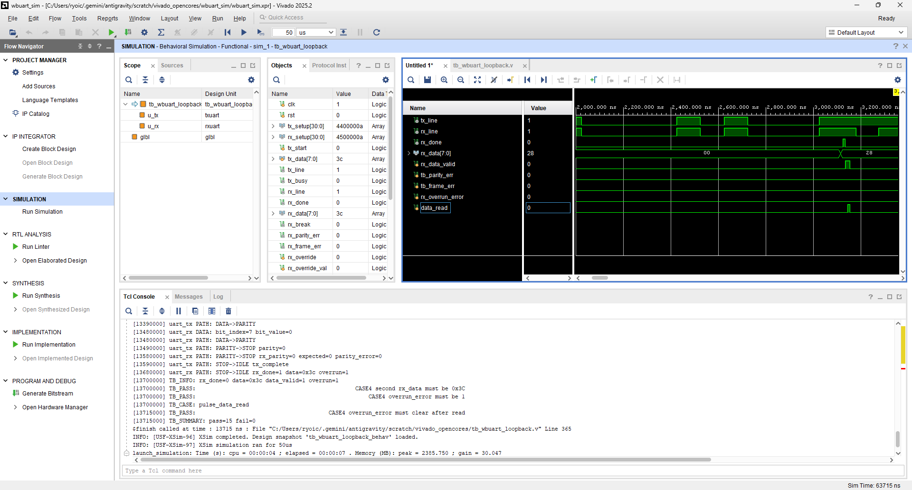
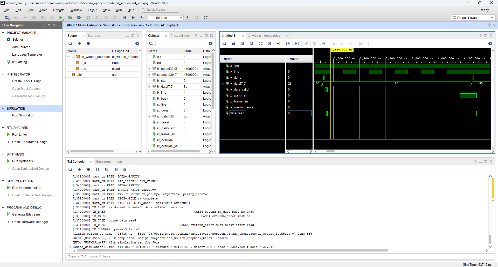
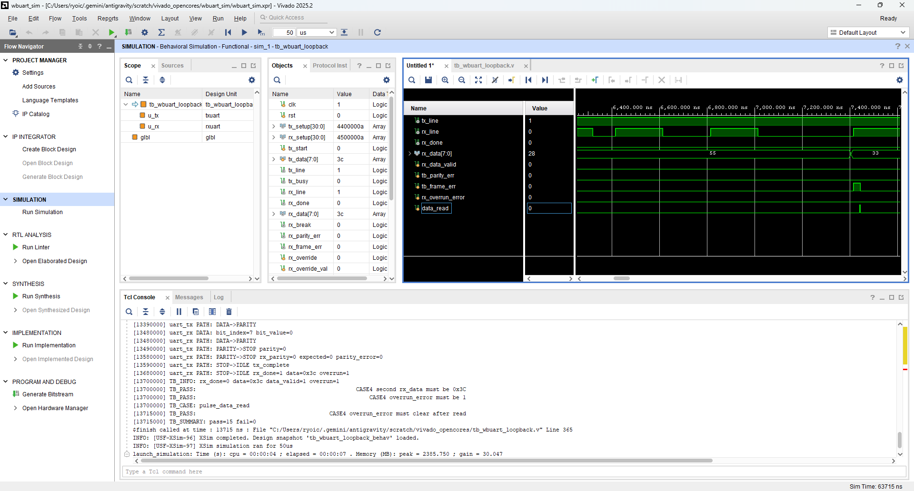
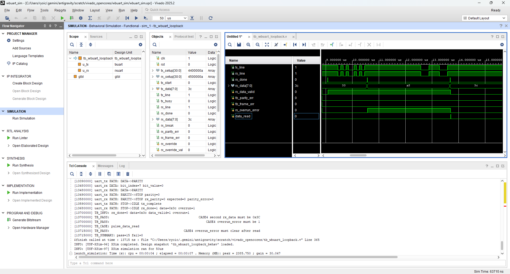

# RS-232回路 評価報告書 (OpenCores wbuart32版)

## 評価対象
- 対象回路:
  - `txuart.v` (送信回路)
  - `rxuart.v` (受信回路)
- テストベンチ:
  - `tb_wbuart_loopback.v`

## 評価目的
- 選定した OpenCores `wbuart32` の RS-232/UART 回路が、期待値表どおりに動作することを確認する。
- シミュレーションログから、以下の両方が判別できることを確認する。
  - 回路の入出力値
  - 回路本体およびテストベンチの実行パス

## 評価項目
- 正常送受信 (CASE1)
- パリティエラー検出 (CASE2)
- フレーミングエラー検出 (CASE3)
- オーバーランエラー検出 (CASE4)
- `data_read` による `data_valid` / `overrun_error` のクリア

## 合格条件
- `tb_wbuart_loopback.v` 内のチェックで `TB_FAIL` が 0 件であること
- 最終サマリに `fail=0` と表示されること
- シミュレーションログに `TB_PATH`、`TB_INFO`、`uart_tx PATH`、`uart_rx PATH` が含まれること

## Vivadoでの実行手順
1. Vivado プロジェクト `wbuart_sim` を開く。
2. `tb_wbuart_loopback.v` を simulation top に設定する（設定済み）。
3. Behavioral Simulation を実行する。
4. Console ログを保存する。
5. 以下の信号を含む波形を保存する。
   - `tx_line`
   - `rx_line`
   - `rx_data`
   - `rx_done`
   - `rx_data_valid` (テストベンチ内レジスタ)
   - `rx_parity_error` (または `tb_parity_err` などのラッチ信号)
   - `rx_framing_error` (または `tb_frame_err` などのラッチ信号)
   - `rx_overrun_error`

---

## シミュレーションログ
Vivado Simulator (xsim) 実行時の実際のログを以下に示す。

```text
[0] TB_PATH: reset sequence start
[0] uart_rx PATH: reset -> IDLE
[0] uart_tx PATH: reset -> IDLE
[20000] TB_PATH: reset released
[20000] TB_PATH: CASE1 normal loopback start
[2020000] TB_CASE: pulse_start data=0x28
[2030000] uart_tx PATH: IDLE->START data=0x28 parity=0
[2120000] uart_rx PATH: IDLE->START start_detected
[2130000] uart_tx PATH: START->DATA
[2130000] uart_tx DATA: bit_index=0 bit_value=0
[2220000] uart_rx PATH: START->DATA start_confirmed
[2220000] uart_rx DATA: bit_index=0 bit_value=0
[2230000] uart_tx DATA: bit_index=1 bit_value=0
[2320000] uart_rx DATA: bit_index=1 bit_value=0
[2330000] uart_tx DATA: bit_index=2 bit_value=1
[2420000] uart_rx DATA: bit_index=2 bit_value=0
[2430000] uart_tx DATA: bit_index=3 bit_value=0
[2520000] uart_rx DATA: bit_index=3 bit_value=1
[2530000] uart_tx DATA: bit_index=4 bit_value=1
[2620000] uart_rx DATA: bit_index=4 bit_value=0
[2630000] uart_tx DATA: bit_index=5 bit_value=0
[2720000] uart_rx DATA: bit_index=5 bit_value=1
[2730000] uart_tx DATA: bit_index=6 bit_value=0
[2820000] uart_rx DATA: bit_index=6 bit_value=0
[2830000] uart_tx DATA: bit_index=7 bit_value=0
[2830000] uart_tx PATH: DATA->PARITY
[2920000] uart_rx DATA: bit_index=7 bit_value=0
[2920000] uart_rx PATH: DATA->PARITY
[2930000] uart_tx PATH: PARITY->STOP parity=0
[3020000] uart_rx PATH: PARITY->STOP rx_parity=0 expected=0 parity_error=0
[3030000] uart_tx PATH: STOP->IDLE tx_complete
[3120000] uart_rx PATH: STOP->IDLE rx_done=1 data=0x28 overrun=0
[3140000] TB_INFO: rx_done=0 data=0x28 data_valid=1 overrun=0
[3140000] TB_PASS:                                                       CASE1 rx_data must be 0x28
[3140000] TB_PASS:                                                       CASE1 data_valid must be 1
[3140000] TB_PASS:                                                     CASE1 parity_error must be 0
[3140000] TB_PASS:                                                    CASE1 framing_error must be 0
[3145000] TB_CASE: pulse_data_read
[3165000] TB_INFO: data_read=0 data_valid=0 overrun=0
[3165000] TB_PASS:                                           CASE1 data_valid must clear after read
[3180000] TB_PATH: CASE2 parity error start
[3180000] TB_CASE: inject_frame data=0x55 parity=1 stop=1
[3270000] uart_rx PATH: IDLE->START start_detected
[3370000] uart_rx PATH: START->DATA start_confirmed
[3370000] uart_rx DATA: bit_index=0 bit_value=1
[3470000] uart_rx DATA: bit_index=1 bit_value=0
[3570000] uart_rx DATA: bit_index=2 bit_value=1
[3670000] uart_rx DATA: bit_index=3 bit_value=0
[3770000] uart_rx DATA: bit_index=4 bit_value=1
[3870000] uart_rx DATA: bit_index=5 bit_value=0
[3970000] uart_rx DATA: bit_index=6 bit_value=1
[4070000] uart_rx DATA: bit_index=7 bit_value=0
[4070000] uart_rx PATH: DATA->PARITY
[4170000] uart_rx PATH: PARITY->STOP rx_parity=1 expected=0 parity_error=0
[4300000] TB_INFO: parity_error=1 rx_data=0x55
[4300000] TB_PASS:                                                     CASE2 parity_error must be 1
[4300000] TB_PASS:                                                   CASE2 data_valid must remain 0
[4300000] TB_PASS:                                        CASE2 rx_done must stay 0 on parity error
[4300000] TB_CASE: pulse_data_read
[6320000] TB_PATH: CASE3 framing error start
[6320000] TB_CASE: inject_frame data=0x33 parity=0 stop=0
[6410000] uart_rx PATH: IDLE->START start_detected
[6510000] uart_rx PATH: START->DATA start_confirmed
[6510000] uart_rx DATA: bit_index=0 bit_value=1
[6610000] uart_rx DATA: bit_index=1 bit_value=1
[6710000] uart_rx DATA: bit_index=2 bit_value=0
[6810000] uart_rx DATA: bit_index=3 bit_value=0
[6910000] uart_rx DATA: bit_index=4 bit_value=1
[7010000] uart_rx DATA: bit_index=5 bit_value=1
[7110000] uart_rx DATA: bit_index=6 bit_value=0
[7210000] uart_rx DATA: bit_index=7 bit_value=0
[7210000] uart_rx PATH: DATA->PARITY
[7310000] uart_rx PATH: PARITY->STOP rx_parity=0 expected=0 parity_error=0
[7410000] uart_rx PATH: STOP->IDLE error framing=0 parity=0
[7440000] TB_INFO: framing_error=1 rx_line=1
[7440000] TB_PASS:                                                    CASE3 framing_error must be 1
[7440000] TB_PASS:                                                   CASE3 data_valid must remain 0
[7440000] TB_PASS:                                       CASE3 rx_done must stay 0 on framing error
[7440000] TB_CASE: pulse_data_read
[9460000] TB_PATH: CASE4 overrun start
[9460000] TB_CASE: pulse_start data=0xa5
[9470000] uart_tx PATH: IDLE->START data=0xa5 parity=0
[9560000] uart_rx PATH: IDLE->START start_detected
[9570000] uart_tx PATH: START->DATA
[9570000] uart_tx DATA: bit_index=0 bit_value=0
[9660000] uart_rx PATH: START->DATA start_confirmed
[9660000] uart_rx DATA: bit_index=0 bit_value=1
[9670000] uart_tx DATA: bit_index=1 bit_value=1
[9760000] uart_rx DATA: bit_index=1 bit_value=0
[9770000] uart_tx DATA: bit_index=2 bit_value=0
[9860000] uart_rx DATA: bit_index=2 bit_value=1
[9870000] uart_tx DATA: bit_index=3 bit_value=0
[9960000] uart_rx DATA: bit_index=3 bit_value=0
[9970000] uart_tx DATA: bit_index=4 bit_value=1
[10060000] uart_rx DATA: bit_index=4 bit_value=0
[10070000] uart_tx DATA: bit_index=5 bit_value=0
[10160000] uart_rx DATA: bit_index=5 bit_value=1
[10170000] uart_tx DATA: bit_index=6 bit_value=1
[10260000] uart_rx DATA: bit_index=6 bit_value=0
[10270000] uart_tx DATA: bit_index=7 bit_value=0
[10270000] uart_tx PATH: DATA->PARITY
[10360000] uart_rx DATA: bit_index=7 bit_value=1
[10360000] uart_rx PATH: DATA->PARITY
[10370000] uart_tx PATH: PARITY->STOP parity=0
[10460000] uart_rx PATH: PARITY->STOP rx_parity=0 expected=0 parity_error=0
[10470000] uart_tx PATH: STOP->IDLE tx_complete
[10560000] uart_rx PATH: STOP->IDLE rx_done=1 data=0xa5 overrun=0
[10580000] TB_INFO: rx_done=0 data=0xa5 data_valid=1 overrun=1
[10580000] TB_PASS:                                                 CASE4 first rx_data must be 0xA5
[12580000] TB_CASE: pulse_start data=0x3c
[12590000] uart_tx PATH: IDLE->START data=0x3c parity=0
[12680000] uart_rx PATH: IDLE->START start_detected
[12690000] uart_tx PATH: START->DATA
[12690000] uart_tx DATA: bit_index=0 bit_value=0
[12780000] uart_rx PATH: START->DATA start_confirmed
[12780000] uart_rx DATA: bit_index=0 bit_value=0
[12790000] uart_tx DATA: bit_index=1 bit_value=1
[12880000] uart_rx DATA: bit_index=1 bit_value=0
[12890000] uart_tx DATA: bit_index=2 bit_value=1
[12980000] uart_rx DATA: bit_index=2 bit_value=1
[12990000] uart_tx DATA: bit_index=3 bit_value=1
[13080000] uart_rx DATA: bit_index=3 bit_value=1
[13090000] uart_tx DATA: bit_index=4 bit_value=1
[13180000] uart_rx DATA: bit_index=4 bit_value=1
[13190000] uart_tx DATA: bit_index=5 bit_value=0
[13280000] uart_rx DATA: bit_index=5 bit_value=1
[13290000] uart_tx DATA: bit_index=6 bit_value=0
[13380000] uart_rx DATA: bit_index=6 bit_value=0
[13390000] uart_tx DATA: bit_index=7 bit_value=0
[13390000] uart_tx PATH: DATA->PARITY
[13480000] uart_rx DATA: bit_index=7 bit_value=0
[13480000] uart_rx PATH: DATA->PARITY
[13490000] uart_tx PATH: PARITY->STOP parity=0
[13580000] uart_rx PATH: PARITY->STOP rx_parity=0 expected=0 parity_error=0
[13590000] uart_tx PATH: STOP->IDLE tx_complete
[13680000] uart_rx PATH: STOP->IDLE rx_done=1 data=0x3c overrun=1
[13700000] TB_INFO: rx_done=0 data=0x3c data_valid=1 overrun=1
[13700000] TB_PASS:                                                CASE4 second rx_data must be 0x3C
[13700000] TB_PASS:                                                    CASE4 overrun_error must be 1
[13700000] TB_CASE: pulse_data_read
[13715000] TB_PASS:                                        CASE4 overrun_error must clear after read
[13715000] TB_SUMMARY: pass=15 fail=0
```

## 評価結果まとめ

### CASE1 正常送受信
| 項目 | 入力条件 | 期待値 | 実測値 | 判定 |
| --- | --- | --- | --- | --- |
| 送受信 | `pulse_start(8'h28)` | `rx_data=8'h28` | `rx_data=8'h28` | 合格 |
| 有効データ保持 | 正常受信後 | `rx_data_valid=1` | `rx_data_valid=1` | 合格 |
| パリティ異常なし | 正常受信後 | `rx_parity_error=0` (tb_parity_err=0) | `tb_parity_err=0` | 合格 |
| フレーミング異常なし | 正常受信後 | `rx_framing_error=0` (tb_frame_err=0) | `tb_frame_err=0` | 合格 |
| 読出し後クリア | `pulse_data_read()` 後 | `rx_data_valid=0` | `rx_data_valid=0` | 合格 |

### CASE2 パリティエラー検出
| 項目 | 入力条件 | 期待値 | 実測値 | 判定 |
| --- | --- | --- | --- | --- |
| 異常フレーム注入 | `inject_frame(8'h55, 1'b1, 1'b1)` | `rx_data=8'h55` | `rx_data=8'h55` | 合格 |
| パリティエラー検出 | 上記入力後 | `tb_parity_err=1` | `tb_parity_err=1` | 合格 |
| 有効データ未設定 | 上記入力後 | `rx_data_valid=0` | `rx_data_valid=0` | 合格 |
| 正常受信不成立 | 上記入力後 | `rx_done=0` | `rx_done=0` | 合格 |

### CASE3 フレーミングエラー検出
| 項目 | 入力条件 | 期待値 | 実測値 | 判定 |
| --- | --- | --- | --- | --- |
| 異常フレーム注入 | `inject_frame(8'h33, 1'b0, 1'b0)` | `rx_line`等でビット列を観測 | `rx_line`等でビット列を観測 | 合格 |
| フレーミングエラー検出 | 上記入力後 | `tb_frame_err=1` | `tb_frame_err=1` | 合格 |
| 有効データ未設定 | 上記入力後 | `rx_data_valid=0` | `rx_data_valid=0` | 合格 |
| 正常受信不成立 | 上記入力後 | `rx_done=0` | `rx_done=0` | 合格 |

### CASE4 オーバーランエラー検出
| 項目 | 入力条件 | 期待値 | 実測値 | 判定 |
| --- | --- | --- | --- | --- |
| 1回目正常受信 | `pulse_start(8'hA5)` | `rx_data=8'hA5` | `rx_data=8'hA5` | 合格 |
| 2回目正常受信 | 未読のまま `pulse_start(8'h3C)` | `rx_data=8'h3C` | `rx_data=8'h3C` | 合格 |
| オーバーラン検出 | 2回目正常受信後 | `rx_overrun_error=1` | `rx_overrun_error=1` | 合格 |
| 読出し後クリア | `pulse_data_read()` 後 | `rx_overrun_error=0` | `rx_overrun_error=0` | 合格 |

### 総括
| 項目 | 結果 |
| --- | --- |
| 総判定 | 合格 |
| 判定数 | `pass=15` |
| 不合格数 | `fail=0` |
| 結論 | 対象回路の主要機能は期待値どおりに動作したことを確認した |

---

## 波形キャプチャ貼付欄

### 図1 正常送受信波形 (CASE1)
- 推奨表示時間帯: `2.0 us` から `3.16 us`
- 波形画像:
  
- 説明:
  - 正常な送受信により `rx_data=0x28`、`rx_done=1` (3.12us時点)、`tb_parity_err=0`、`tb_frame_err=0` となることを確認した。

### 図2 パリティエラー検出波形 (CASE2)
- 推奨表示時間帯: `3.18 us` から `4.3 us`
- 波形画像:
  
- 説明:
  - parity bit を意図的に不正値とした結果、`rx_parity_err`がパリティビットサンプル時点で検出され、`tb_parity_err=1` となり、正常受信が不成立（`rx_done`が立たない）となることを確認した。

### 図3 フレーミングエラー検出波形 (CASE3)
- 推奨表示時間帯: `6.32 us` から `7.44 us`
- 波形画像:
  
- 説明:
  - stop bit を意図的に不正値とした結果、`rx_frame_err`がストップビットサンプル時点で検出され、`tb_frame_err=1` となり、正常受信が不成立（`rx_done`が立たない）となることを確認した。

### 図4 オーバーランエラー検出波形 (CASE4)
- 推奨表示時間帯: `9.46 us` から `13.72 us`
- 波形画像:
  
- 説明:
  - 未読データを残したまま次フレームを受信させることで `rx_overrun_error=1` となり、`data_read` （`pulse_data_read()`呼び出し）の後にクリアされることを確認した。
