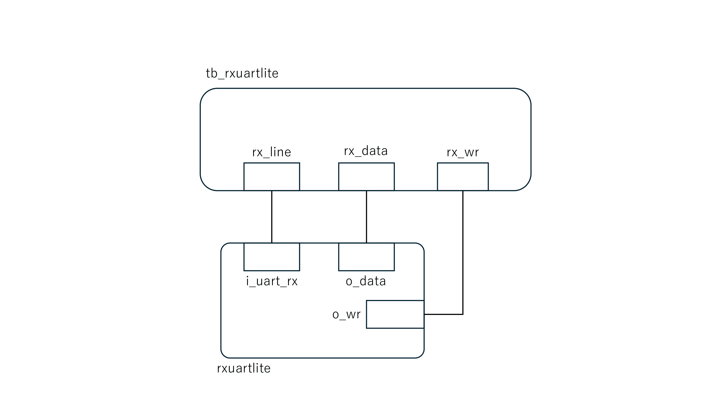

# RS-232回路およびテストベンチ説明書

## 対象ファイル
- `rxuartlite.v`: UART受信回路
- `tb_rxuartlite.v`: 検証用テストベンチ

## 回路概要

## 実装する通信仕様の概要
本回路で扱う RS-232/UART 通信は、1本の信号線にビットを時間順に並べて送る非同期シリアル通信である。クロック信号そのものは受信線には流さず、受信側はstart bit をきっかけとして，あらかじめ設定された1bit幅の時間間隔に従って各ビットを順番にサンプリングする。

今回のテストベンチでは、送信側、受信側、接続線の関係は以下のようになる。
- データを送る側はテストベンチ `tb_rxuartlite.v` である。
- テストベンチは、送信したい 8bit データを受け取り，UARTの`8N1`フレーム形式に変換する。
- テストベンチは、`i_uart_rx` の入力を直接制御して入力する．
- `rxuartlite` は `i_uart_rx` 入力に流れてきたフレームを RS-232/UART の形式に従って受信し、取り出した 8bit のデータ部分を `o_data` に書き込む。

送信される1フレームの形式は以下のとおりである。

```text
1 start bit + 8 data bits + 1 stop bit
```

各ビットの役割は以下のとおりである。
- `start bit`: フレームの開始を示すビットで、受信側が「ここからデータが来る」と判断するために使う。
- `8 data bits`: 実際に送りたいデータ本体である。
- `stop bit`: フレームの終了を示すビットである。

つまり、テストベンチで用意した8bitデータの値そのものがそのまま1本の線に出るのではなく、start bitとstop bit を付けた`8N1`フレームに変換されて`i_uart_rx`に入力される。`rxuartlite` はそのフレームから 8 data bits の部分だけを受信データとして取り出し、正常に受信できた場合に `o_data`を更新し，受信完了を示す`o_wr`を1クロックだけ`1`にする。

## 構成図（ブロック図）



## `rxuartlite.v`
### 入力信号
- `i_clk`: システムクロック
- `i_uart_rx`: シリアル受信線

### 出力信号
- `o_data`: 受信データ
- `o_wr`: 正常受信完了時に 1 クロックだけ立つ信号

### 内部レジスタ
- `state`: UART受信の状態を管理する
- `baud_counter`: 1ビット分の時間を数えるカウンタ
- `zero_baud_counter`: baud_counterが0になるタイミングを示す補助フラグ
- `q_uart`:UART入力同期化用の1段目
- `qq_uart`:UART入力同期化用の2段目
- `ck_uart`:UART入力同期化用の3段目、主に受信判定に使う
- `chg_counter`:UART入力が最後に変化してからのクロック数
- `half_baud_time`:受信線がLowのまま約半ビット時間経過したことを示す信号
- `data_reg`: 受信中のデータを一時的に保持するシフトレジスタ

### 機能
- アイドル状態では `i_uart_rx` がHighであることを前提に待機する
- `i_uart_rx` のLowを検出し、start bit の開始を判断する
- start bit が約半ビット時間Lowのままであることを確認し、誤検出を防ぐ
- データ8bitをLSB firstで順番に受信する
- stop bit がHighであることを確認する
- 正常に1フレームを受信できた場合、受信データを `o_data` に出力し、`o_wr` を1クロックだけ立てる

### シミュレーションログ出力
- 送信開始受付
- 各データ bit の送信
- フレーム送信完了

### エラー動作
`rxuartlite.v` は簡易的な UART 受信回路であり、`8N1` 形式の正常な受信を対象としている。そのため、parity error、framing error、overrun error などを外部に通知する専用の出力信号は持たない。

したがって、本評価では異常フレームを注入してエラー信号を確認する検証は行わず、正常な `8N1` フレームを入力したときに `o_data` と `o_wr` が期待どおりに出力されることを確認対象とする。

### 主要ステータス信号とテスト内容
#### `o_wr` の確認

意味:
- `rxuartlite` が正常に 1 フレームを受信したことを示す。
- 正常受信が完了したタイミングで、`o_wr` は 1 クロックだけ `1` になる。
- `o_wr=1` のタイミングで、`o_data` に有効な受信データが出力される。

テスト内容:
- `CASE1`
  - `8'h00` の正常な `8N1` フレームを `rx_line` から入力する。
  - 受信完了時に `rx_wr` が `1` になり、`rx_data=8'h00` となることを確認する。
  - `rx_wr` が 1 クロックだけ立ち、その後 `0` に戻ることを確認する。
- `CASE2`
  - `8'hFF` の正常な `8N1` フレームを `rx_line` から入力する。
  - 受信完了時に `rx_wr` が `1` になり、`rx_data=8'hFF` となることを確認する。
  - `rx_wr` が 1 クロックだけ立ち、その後 `0` に戻ることを確認する。
- `CASE3`
  - `8'h55` の正常な `8N1` フレームを `rx_line` から入力する。
  - 受信完了時に `rx_wr` が `1` になり、`rx_data=8'h55` となることを確認する。
  - `rx_wr` が 1 クロックだけ立ち、その後 `0` に戻ることを確認する。
- `CASE4`
  - `8'hAA` の正常な `8N1` フレームを `rx_line` から入力する。
  - 受信完了時に `rx_wr` が `1` になり、`rx_data=8'hAA` となることを確認する。
  - `rx_wr` が 1 クロックだけ立ち、その後 `0` に戻ることを確認する。


## `tb_rxuartlite.v`
### 目的
- 主要機能を一通り検証する
- 実行パスをシミュレーションログに残す
- 回路の入出力値をシミュレーションログに残す

### テストケース
- `CASE1`: `8'h00` の正常受信
- `CASE2`: `8'hFF` の正常受信
- `CASE3`: `8'h55` の正常受信
- `CASE4`: `8'hAA` の正常受信

### Vivado Wave で観測すべき主な信号
- `rx_line`
- `rx_data`
- `rx_wr`
