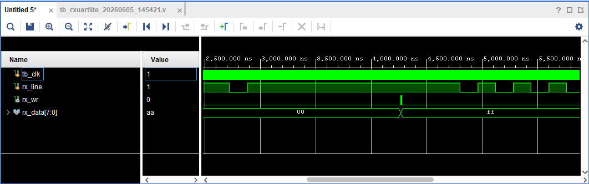
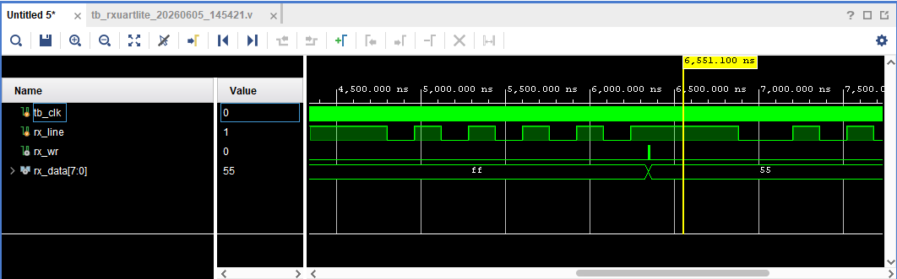
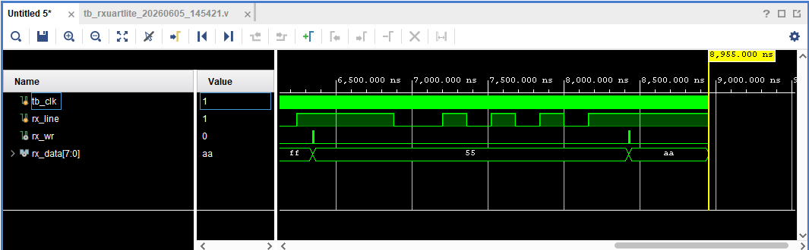

# RS-232回路 評価報告書

## 評価対象
- 対象回路:
  - `rxuartlite.v`
- テストベンチ:
  - `tb_rxuartlite.v`

## 評価目的
- 選定した RS-232/UART 回路が、期待値表どおりに動作することを確認する。
- シミュレーションログから、以下の両方が判別できることを確認する。
  - 回路の入出力値
  - 回路本体およびテストベンチの実行パス

## 評価項目
- 正常受信
  - 全ビット0の受信確認
  - 全ビット1の受信確認
  - 交互ビットパターン `8'h55` の受信確認
  - 交互ビットパターン `8'hAA` の受信確認

## 合格条件
- `tb_rxuartlite.v` 内のチェックで `TB_FAIL` が 0 件であること
- 最終サマリに `fail=0` と表示されること
- `8'h00`、`8'hFF`、`8'h55`、`8'hAA` の各入力に対して、受信完了を示す `rx_wr` が 1 クロックだけ立つこと
- `rx_wr=1` のタイミングで、受信データ `rx_data` が各入力データと一致すること
- シミュレーションログに `TB_PATH`、`TB_CASE`、`TB_INFO`、`TB_DUT_PATH`、`TB_SUMMARY` が含まれること

## Vivadoでの実行手順
1. Vivado プロジェクトを開く。
2. `tb_rxuartlite.v` を simulation top に設定する。
3. Behavioral Simulation を実行する。
4. Console ログを保存する。
5. 以下の信号を含む波形を保存する。
   - `rx_line`
   - `rx_data`
   - `rx_wr`


## シミュレーションログ
Vivado 実行時のログを以下に示す。

```text
[0] TB_PATH: simulation start
[635000] TB_PASS: rx_wr must stay 0 during idle before reception
[635000] TB_PATH: CASE1 normal receive start
[635000] TB_CASE: send_8n1 data=0x00
[755000] TB_DUT_PATH: IDLE -> BIT_ZERO
[915000] TB_DUT_PATH: BIT_ZERO -> BIT_ONE
INFO: [USF-XSim-96] XSim completed. Design snapshot 'tb_rxuartlite_behav' loaded.
INFO: [USF-XSim-97] XSim simulation ran for 1000ns
run all
[1075000] TB_DUT_PATH: BIT_ONE -> BIT_TWO
[1235000] TB_DUT_PATH: BIT_TWO -> BIT_THREE
[1395000] TB_DUT_PATH: BIT_THREE -> BIT_FOUR
[1555000] TB_DUT_PATH: BIT_FOUR -> BIT_FIVE
[1715000] TB_DUT_PATH: BIT_FIVE -> BIT_SIX
[1875000] TB_DUT_PATH: BIT_SIX -> BIT_SEVEN
[2035000] TB_DUT_PATH: BIT_SEVEN -> STOP
[2186000] TB_PASS: rx_wr must assert after a valid 8N1 frame
[2186000] TB_INFO: rx_wr=1 rx_data=0x00 expected=0x00
[2186000] TB_PASS: rx_data must match transmitted byte
[2195000] TB_DUT_PATH: STOP -> WAIT
[2196000] TB_PASS: rx_wr must be a one-clock pulse
[2205000] TB_DUT_PATH: WAIT -> IDLE
[2715000] TB_PATH: CASE2 normal receive start
[2715000] TB_CASE: send_8n1 data=0xff
[2835000] TB_DUT_PATH: IDLE -> BIT_ZERO
[2995000] TB_DUT_PATH: BIT_ZERO -> BIT_ONE
[3155000] TB_DUT_PATH: BIT_ONE -> BIT_TWO
[3315000] TB_DUT_PATH: BIT_TWO -> BIT_THREE
[3475000] TB_DUT_PATH: BIT_THREE -> BIT_FOUR
[3635000] TB_DUT_PATH: BIT_FOUR -> BIT_FIVE
[3795000] TB_DUT_PATH: BIT_FIVE -> BIT_SIX
[3955000] TB_DUT_PATH: BIT_SIX -> BIT_SEVEN
[4115000] TB_DUT_PATH: BIT_SEVEN -> STOP
[4266000] TB_PASS: rx_wr must assert after a valid 8N1 frame
[4266000] TB_INFO: rx_wr=1 rx_data=0xff expected=0xff
[4266000] TB_PASS: rx_data must match transmitted byte
[4275000] TB_DUT_PATH: STOP -> WAIT
[4276000] TB_PASS: rx_wr must be a one-clock pulse
[4285000] TB_DUT_PATH: WAIT -> IDLE
[4795000] TB_PATH: CASE3 normal receive start
[4795000] TB_CASE: send_8n1 data=0x55
[4915000] TB_DUT_PATH: IDLE -> BIT_ZERO
[5075000] TB_DUT_PATH: BIT_ZERO -> BIT_ONE
[5235000] TB_DUT_PATH: BIT_ONE -> BIT_TWO
[5395000] TB_DUT_PATH: BIT_TWO -> BIT_THREE
[5555000] TB_DUT_PATH: BIT_THREE -> BIT_FOUR
[5715000] TB_DUT_PATH: BIT_FOUR -> BIT_FIVE
[5875000] TB_DUT_PATH: BIT_FIVE -> BIT_SIX
[6035000] TB_DUT_PATH: BIT_SIX -> BIT_SEVEN
[6195000] TB_DUT_PATH: BIT_SEVEN -> STOP
[6346000] TB_PASS: rx_wr must assert after a valid 8N1 frame
[6346000] TB_INFO: rx_wr=1 rx_data=0x55 expected=0x55
[6346000] TB_PASS: rx_data must match transmitted byte
[6355000] TB_DUT_PATH: STOP -> WAIT
[6356000] TB_PASS: rx_wr must be a one-clock pulse
[6365000] TB_DUT_PATH: WAIT -> IDLE
[6875000] TB_PATH: CASE4 normal receive start
[6875000] TB_CASE: send_8n1 data=0xaa
[6995000] TB_DUT_PATH: IDLE -> BIT_ZERO
[7155000] TB_DUT_PATH: BIT_ZERO -> BIT_ONE
[7315000] TB_DUT_PATH: BIT_ONE -> BIT_TWO
[7475000] TB_DUT_PATH: BIT_TWO -> BIT_THREE
[7635000] TB_DUT_PATH: BIT_THREE -> BIT_FOUR
[7795000] TB_DUT_PATH: BIT_FOUR -> BIT_FIVE
[7955000] TB_DUT_PATH: BIT_FIVE -> BIT_SIX
[8115000] TB_DUT_PATH: BIT_SIX -> BIT_SEVEN
[8275000] TB_DUT_PATH: BIT_SEVEN -> STOP
[8426000] TB_PASS: rx_wr must assert after a valid 8N1 frame
[8426000] TB_INFO: rx_wr=1 rx_data=0xaa expected=0xaa
[8426000] TB_PASS: rx_data must match transmitted byte
[8435000] TB_DUT_PATH: STOP -> WAIT
[8436000] TB_PASS: rx_wr must be a one-clock pulse
[8445000] TB_DUT_PATH: WAIT -> IDLE
[8955000] TB_SUMMARY: pass=13 fail=0
[8955000] TB_RESULT: PASS
```

## 評価結果まとめ
### CASE1 正常受信(0x00)
| 項目 | 入力条件 | 期待値 | 実測値 | 判定 |
| --- | --- | --- | --- | --- |
| 受信 | `send_8n1(8'h00)` | `rx_data=8'h00` | `rx_data=8'h00` | 合格 |
| 受信完了 | `send_8n1(8'h00)` | `rx_wr=1` | `rx_wr=1` | 合格 |

### CASE2 正常受信(0xFF)
| 項目 | 入力条件 | 期待値 | 実測値 | 判定 |
| --- | --- | --- | --- | --- |
| 受信 | `send_8n1(8'hFF)` | `rx_data=8'FF` | `rx_data=8'hFF` | 合格 |
| 受信完了 | `send_8n1(8'hFF)` | `rx_wr=1` | `rx_wr=1` | 合格 |

### CASE3 正常受信(0x55)
| 項目 | 入力条件 | 期待値 | 実測値 | 判定 |
| --- | --- | --- | --- | --- |
| 受信 | `send_8n1(8'h55)` | `rx_data=8'h55` | `rx_data=8'h55` | 合格 |
| 受信完了 | `send_8n1(8'h55)` | `rx_wr=1` | `rx_wr=1` | 合格 |

### CASE4 正常受信(0xAA)
| 項目 | 入力条件 | 期待値 | 実測値 | 判定 |
| --- | --- | --- | --- | --- |
| 受信 | `send_8n1(8'hAA)` | `rx_data=8'hAA` | `rx_data=8'hAA` | 合格 |
| 受信完了 | `send_8n1(8'hAA)` | `rx_wr=1` | `rx_wr=1` | 合格 |

### 総括
| 項目 | 結果 |
| --- | --- |
| 総判定 | 合格 |
| 判定数 | `pass=13` |
| 不合格数 | `fail=0` |
| 結論 | 対象回路は、基本テストパターン `8'h00`、`8'hFF`、`8'h55`、`8'hAA` に対して期待どおりに正常受信できることを確認した |

## 波形キャプチャ貼付欄

### 図1 正常受信(0x00)波形
- 対象ケース: CASE1
- 推奨表示信号:
  - `rx_line`
  - `rx_data`
  - `rx_wr`
- 推奨表示時間帯: `0.5 us` から `2.5 us`
- 説明:
  - 正常な受信により `rx_data=0x00`、`rx_wr=1`となることを確認した。


### 図2 正常受信(0xFF)波形
- 対象ケース: CASE2
- 推奨表示信号:
  - `rx_line`
  - `rx_data`
  - `rx_wr`
- 推奨表示時間帯: `2.5 us` から `4.5 us`
- 説明:
  - 正常な受信により `rx_data=0xFF`、`rx_wr=1`となることを確認した。



### 図3 正常受信(0x55)波形
- 対象ケース: CASE3
- 推奨表示信号:
  - `rx_line`
  - `rx_data`
  - `rx_wr`
- 推奨表示時間帯: `4.5 us` から `6.5 us`
- 説明:
  - 正常な受信により `rx_data=0x55`、`rx_wr=1`となることを確認した。



### 図4 正常受信(0xAA)波形
- 対象ケース: CASE4
- 推奨表示信号:
  - `rx_line`
  - `rx_data`
  - `rx_wr`
- 推奨表示時間帯: `6.5 us` から `9.0 us`
- 説明:
  - 正常な受信により `rx_data=0xAA`、`rx_wr=1`となることを確認した。

