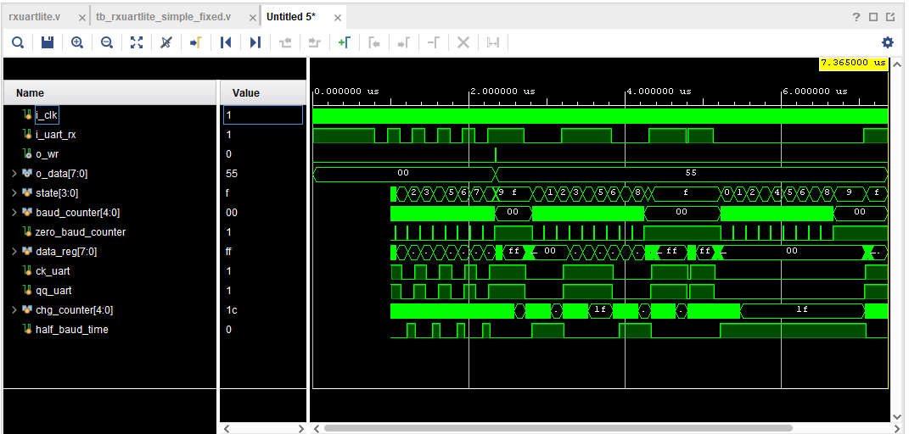

# RS-232回路 評価報告書

## 評価対象
- 対象回路:
  - `rxuartlite.v`
- テストベンチ:
  - `tb_rxuartlite.v`

## 評価目的
- 選定した RS-232/UART 回路が、期待値表どおりに動作することを確認する。
- シミュレーションログから、以下の両方が判別できることを確認する。
  - 回路の入出力値
  - 回路本体およびテストベンチの実行パス

## 評価項目
- 正常受信

## 合格条件
- `tb_rxuartlite.v` 内のチェックで `TB_FAIL` が 0 件であること
- 最終サマリに `fail=0` と表示されること
- シミュレーションログに `TB_PATH`、`TB_INFO`、`TB_DUT_PATH` が含まれること

## Vivadoでの実行手順
1. Vivado プロジェクトを開く。
2. `tb_rxuartlite.v` を simulation top に設定する。
3. Behavioral Simulation を実行する。
4. Console ログを保存する。
5. 以下の信号を含む波形を保存する。
   - `rx_line`
   - `rx_data`
   - `rx_wr`


## シミュレーションログ
Vivado 実行時のログを以下に示す。

```text
[0] TB_PATH: simulation start
[5000] TB_DUT_PATH: UNKNOWN -> IDLE
[635000] TB_PASS: rx_wr must stay 0 during idle before reception
[635000] TB_CASE: send_8n1 data=0x55
[755000] TB_DUT_PATH: IDLE -> BIT_ZERO
[915000] TB_DUT_PATH: BIT_ZERO -> BIT_ONE
run all
[1075000] TB_DUT_PATH: BIT_ONE -> BIT_TWO
[1235000] TB_DUT_PATH: BIT_TWO -> BIT_THREE
[1395000] TB_DUT_PATH: BIT_THREE -> BIT_FOUR
[1555000] TB_DUT_PATH: BIT_FOUR -> BIT_FIVE
[1715000] TB_DUT_PATH: BIT_FIVE -> BIT_SIX
[1875000] TB_DUT_PATH: BIT_SIX -> BIT_SEVEN
[2035000] TB_DUT_PATH: BIT_SEVEN -> STOP
[2186000] TB_PASS: rx_wr must assert after a valid 8N1 frame
[2186000] TB_INFO: rx_wr=1 rx_data=0x55 expected=0x55
[2186000] TB_PASS: rx_data must match transmitted byte
[2195000] TB_DUT_PATH: STOP -> WAIT
[2196000] TB_PASS: rx_wr must be a one-clock pulse
[2205000] TB_DUT_PATH: WAIT -> IDLE
[2715000] TB_CASE: send_8n1 data=0x00
[4266000] TB_PASS: rx_wr must assert after a valid 8N1 frame
[4266000] TB_INFO: rx_wr=1 rx_data=0x00 expected=0x00
[4266000] TB_PASS: rx_data must match transmitted byte
[4276000] TB_PASS: rx_wr must be a one-clock pulse
[4795000] TB_CASE: send_8n1 data=0xff
[6346000] TB_PASS: rx_wr must assert after a valid 8N1 frame
[6346000] TB_INFO: rx_wr=1 rx_data=0xff expected=0xff
[6346000] TB_PASS: rx_data must match transmitted byte
[6356000] TB_PASS: rx_wr must be a one-clock pulse
[6875000] TB_CASE: send_8n1 data=0xa5
[8426000] TB_PASS: rx_wr must assert after a valid 8N1 frame
[8426000] TB_INFO: rx_wr=1 rx_data=0xa5 expected=0xa5
[8426000] TB_PASS: rx_data must match transmitted byte
[8436000] TB_PASS: rx_wr must be a one-clock pulse
[8955000] TB_SUMMARY: pass=13 fail=0
[8955000] TB_RESULT: PASS
```

## 評価結果まとめ
### CASE1 正常受信
| 項目 | 入力条件 | 期待値 | 実測値 | 判定 |
| --- | --- | --- | --- | --- |
| 受信 | `send_8n1(8'h55)` | `rx_data=8'h55` | `rx_data=8'h55` | 合格 |
| 受信完了 | `send_8n1(8'h55)` | `rx_wr=1` | `rx_wr=1` | 合格 |

### 総括
| 項目 | 結果 |
| --- | --- |
| 総判定 | 合格 |
| 判定数 | `pass=13` |
| 不合格数 | `fail=0` |
| 結論 | 対象回路の主要機能は期待値どおりに動作したことを確認した |

## 波形キャプチャ貼付欄

### 図1 正常送受信波形
- 対象ケース: CASE1
- 推奨表示信号:
  - `rx_line`
  - `rx_data`
  - `rx_wr`
- 推奨表示時間帯: `1.0 us` から `1.2 us`
- 説明:
  - 正常な送受信により `rx_data=0x55`、`rx_wr=1`となることを確認した。


