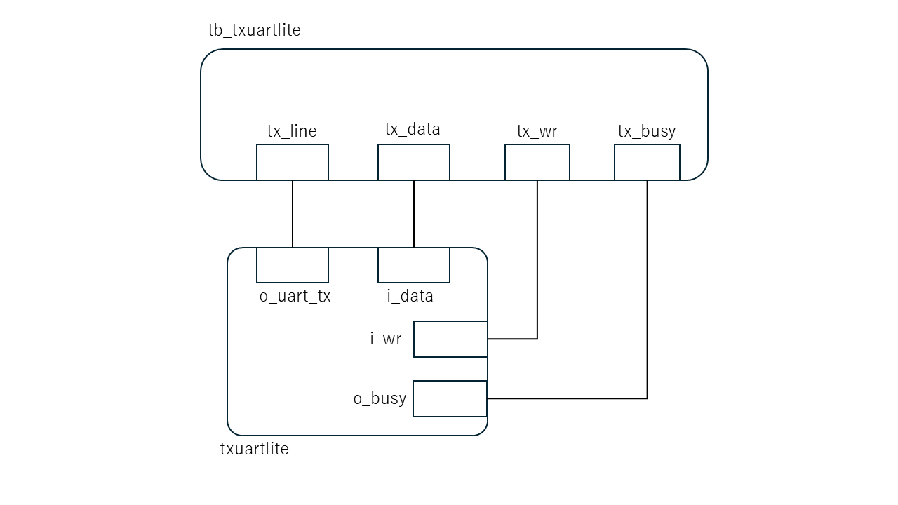

# RS-232回路およびテストベンチ説明書

## 対象ファイル
- `txuartlite.v`: UART送信回路
- `tb_txuartlite.v`: 検証用テストベンチ

## 回路概要

## 実装する通信仕様の概要
本回路で扱う RS-232/UART 通信は、1本の信号線にビットを時間順に並べて送る非同期シリアル通信である。クロック信号そのものは送信線には流さず、送信側と受信側が同じビット幅の時間間隔を前提として、start bit をきっかけに各ビットを順番に解釈する。

今回のテストベンチでは、送信側、受信側、接続線の関係は以下のようになる。
- データを送る側はテストベンチ `tb_txuartlite.v` である。
- テストベンチは、送信したい 8bit データを `tx_data[7:0]` レジスタにセットする。
- テストベンチは、 `tx_wr` を 1 クロックだけ `1` にして送信開始を指示する。
- `txuartlite` は `tx_wr` を受けると、`tx_data` の値を内部に取り込み、`o_uart_tx` 出力へ1ビットずつシリアルデータとして流す。

送信される1フレームの形式は以下のとおりである。

```text
1 start bit + 8 data bits + 1 stop bit
```

各ビットの役割は以下のとおりである。
- `start bit`: フレームの開始を示すビットで、受信側が「ここからデータが来る」と判断するために使う。
- `8 data bits`: 実際に送りたいデータ本体である。今回でいえば、テストベンチが `tx_data[7:0]` にセットした値がこの部分に入る。
- `stop bit`: フレームの終了を示すビットである。

つまり、`i_data` に入っている値そのものがそのまま1本の線に出るのではなく、start bit、stop bit を付けたフレームに変換されて送信される。`txuartlite` は、`i_data[7:0]` の値を 8 data bits としてフレームに含め、`o_uart_tx` から順に送信する。正常に送信できた場合に`o_busy`を`0`に戻す。

## 構成図（ブロック図）


## `txuartlite.v`
### 入力信号
- `i_clk`: システムクロック
- `i_wr`: 送信開始要求
- `i_data[7:0]`: 送信データ

### 出力信号
- `o_uart_tx`: シリアル送信線
- `o_busy`: 送信中フラグ

### 内部レジスタ
- `state`: 送信状態を管理するステートマシン
- `baud_counter`: UART の 1bit 期間を数えるカウンタ
- `zero_baud_counter`: `baud_counter` が 0 になるタイミングを示す信号
- `lcl_data`: `i_data[7:0]` を保持し、LSB first の出力を行うレジスタ
- `r_busy`: 送信中であることを保持し、`o_busy` の値として出力される内部フラグ

### 機能
- `TXUL_IDLE` で待機する
- `o_busy=0` のときに `i_wr=1` が入力されると、`i_data[7:0]` を `lcl_data` に取り込む。
- start bit を送信する。
- データ8bitを LSB first で送信する。
- stop bit を送信して待機状態に戻る。
- 送信中に `i_wr=1` が入力されても、新しいデータは受け付けない。

### シミュレーションログ出力
- シミュレーション開始
- 初期待機状態の確認
- 各 CASE の開始
- `tx_wr` による送信開始
- DUT の状態遷移
- 各 CASE の合否
- 最終サマリ

### エラー動作
- `txuartlite` には、パリティエラーやフレーミングエラーを示す専用のエラー出力はない。
- `tx_busy=1` の送信中に `tx_wr=1` が入力されても、新しい送信データは受け付けられない。
- 今回の評価では、CASE5 において `tx_busy=1` 中の書き込みが無視されることを確認する。

### 主要ステータス信号とテスト内容
#### `tx_busy` の確認
意味:
- `tx_busy` は、`txuartlite` が送信中であることを示す信号である。
- `tx_busy=1` においては `i_wr=1` を無視する

テスト内容:
- `CASE1`
  - `8'h00` の正常なフレームを `tx_data` から入力する。
  - `tx_wr` により `8'h00` の送信を開始した後、送信中に `tx_busy=1` となることを確認する。
  - 1フレームの送信完了後、`tx_busy=0` に戻ることを確認する。
- `CASE2`
  - `8'hFF` の正常なフレームを `tx_data` から入力する。
  - `tx_wr` により `8'hFF` の送信を開始した後、送信中に `tx_busy=1` となることを確認する。
  - 1フレームの送信完了後、`tx_busy=0` に戻ることを確認する。
- `CASE3`
  - `8'h55` の正常なフレームを `tx_data` から入力する。
  - `tx_wr` により `8'h55` の送信を開始した後、送信中に `tx_busy=1` となることを確認する。
  - 1フレームの送信完了後、`tx_busy=0` に戻ることを確認する。
- `CASE4`
  - `8'hAA` の正常なフレームを `tx_data` から入力する。
  - `tx_wr` により `8'hAA` の送信を開始した後、送信中に `tx_busy=1` となることを確認する。
  - 1フレームの送信完了後、`tx_busy=0` に戻ることを確認する。
- `CASE5`
  - まず `8'h55` を正常送信し、`tx_busy=1` の送信中状態を作る。
  - 送信中に `tx_data=8'hAA`、`tx_wr=1` を1クロックだけ入力する。
  - 送信中の `8'h55` のフレームが変化しないことを確認する。
  - 送信完了後に `8'hAA` の追加フレームが開始しないことを確認する。

## `tb_txuartlite.v`
### 目的
- 主要機能を一通り検証する
- 実行パスをシミュレーションログに残す
- 回路の入出力値をシミュレーションログに残す

### テストケース
- `CASE1`: `8'h00` の正常送信
- `CASE2`: `8'hFF` の正常送信
- `CASE3`: `8'h55` の正常送信
- `CASE4`: `8'hAA` の正常送信
- `CASE5`: `tx_busy=1` の送信中に `tx_wr=1` を入力し、追加書き込みが無視されることを確認

### Vivado Wave で観測すべき主な信号
- `tx_line`
- `tx_data`
- `tx_wr`
- `tx_busy`
