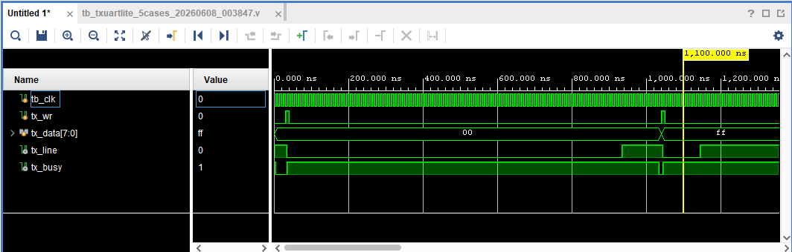
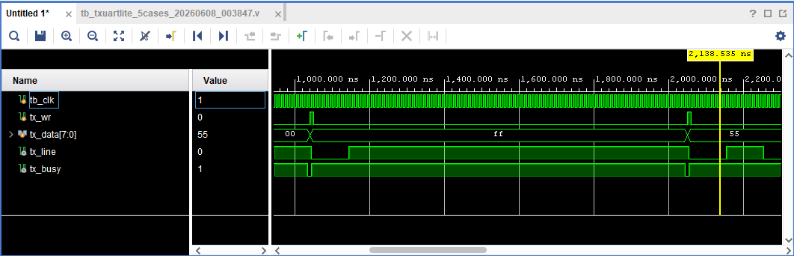

# RS-232回路 評価報告書

## 評価対象
- 対象回路:
  - `txuartlite.v`
- テストベンチ:
  - `tb_txuartlite.v`

## 評価目的
- `txuartlite.v` が、期待値表どおりに動作することを確認する。
- シミュレーションログから、以下の両方が判別できることを確認する。
  - 回路の入出力値
  - 回路本体およびテストベンチの実行パス

## 評価項目
- 正常送信
  - `8'h00` の正常送信
  - `8'hFF` の正常送信
  - `8'h55` の正常送信
  - `8'hAA` の正常送信
- `tx_busy=1` 中に `tx_wr=1` を入力した場合の書き込み無視動作

## 合格条件
- `tb_txuartlite.v` 内のチェックで `TB_FAIL` が 0 件であること
- 最終サマリに `fail=0` と表示されること
- 最終結果に `TB_RESULT: PASS` と表示されること。
- シミュレーションログに `TB_PATH`、`TB_CASE`、`TB_INFO`、`TB_PASS`、`TB_DUT_PATH` が含まれること

## Vivadoでの実行手順
1. Vivado プロジェクトを開く。
2. `tb_txuartlite.v` を simulation top に設定する。
3. Behavioral Simulation を実行する。
4. Console ログを保存する。
5. 以下の信号を含む波形を保存する。
   - `tx_line`
   - `tx_data`
   - `tx_wr`
   - `tx_busy`


## シミュレーションログ
Vivado 実行時のログを以下に示す。

```text
[0] TB_PATH: simulation start
[6000] TB_DUT_PATH: UNKNOWN -> IDLE
[26000] TB_PATH: initial settle done
[26000] TB_PASS: IDLE tx_line must be 1 before tests
[26000] TB_PASS: IDLE tx_busy must be 0 before tests
[26000] TB_PATH: CASE1 normal transmit start
[36000] TB_CASE: CASE1 pulse_write tx_data=0x00
[36000] TB_INFO: tx_wr=1 tx_data=0x00 tx_line=0 tx_busy=1
[36000] TB_DUT_PATH: IDLE -> BIT_ZERO
[136000] TB_DUT_PATH: BIT_ZERO -> BIT_ONE
[236000] TB_DUT_PATH: BIT_ONE -> BIT_TWO
[336000] TB_DUT_PATH: BIT_TWO -> BIT_THREE
[436000] TB_DUT_PATH: BIT_THREE -> BIT_FOUR
[536000] TB_DUT_PATH: BIT_FOUR -> BIT_FIVE
[636000] TB_DUT_PATH: BIT_FIVE -> BIT_SIX
[736000] TB_DUT_PATH: BIT_SIX -> BIT_SEVEN
[836000] TB_DUT_PATH: BIT_SEVEN -> STOP
[936000] TB_DUT_PATH: STOP -> STOP_HOLD
[1036000] TB_PASS: CASE1 8N1 frame must match expected bit sequence
[1036000] TB_PASS: CASE1 tx_busy must stay 1 during frame
[1036000] TB_PASS: CASE1 tx_busy must clear after stop bit
[1036000] TB_PASS: CASE1 tx_line must return to idle high
[1036000] TB_PATH: CASE2 normal transmit start
[1036000] TB_DUT_PATH: STOP_HOLD -> IDLE
[1046000] TB_CASE: CASE2 pulse_write tx_data=0xff
[1046000] TB_INFO: tx_wr=1 tx_data=0xff tx_line=0 tx_busy=1
[1046000] TB_DUT_PATH: IDLE -> BIT_ZERO
[1146000] TB_DUT_PATH: BIT_ZERO -> BIT_ONE
[1246000] TB_DUT_PATH: BIT_ONE -> BIT_TWO
[1346000] TB_DUT_PATH: BIT_TWO -> BIT_THREE
[1446000] TB_DUT_PATH: BIT_THREE -> BIT_FOUR
[1546000] TB_DUT_PATH: BIT_FOUR -> BIT_FIVE
[1646000] TB_DUT_PATH: BIT_FIVE -> BIT_SIX
[1746000] TB_DUT_PATH: BIT_SIX -> BIT_SEVEN
[1846000] TB_DUT_PATH: BIT_SEVEN -> STOP
[1946000] TB_DUT_PATH: STOP -> STOP_HOLD
[2046000] TB_PASS: CASE2 8N1 frame must match expected bit sequence
[2046000] TB_PASS: CASE2 tx_busy must stay 1 during frame
[2046000] TB_PASS: CASE2 tx_busy must clear after stop bit
[2046000] TB_PASS: CASE2 tx_line must return to idle high
[2046000] TB_PATH: CASE3 normal transmit start
[2046000] TB_DUT_PATH: STOP_HOLD -> IDLE
[2056000] TB_CASE: CASE3 pulse_write tx_data=0x55
[2056000] TB_INFO: tx_wr=1 tx_data=0x55 tx_line=0 tx_busy=1
[2056000] TB_DUT_PATH: IDLE -> BIT_ZERO
[2156000] TB_DUT_PATH: BIT_ZERO -> BIT_ONE
[2256000] TB_DUT_PATH: BIT_ONE -> BIT_TWO
[2356000] TB_DUT_PATH: BIT_TWO -> BIT_THREE
[2456000] TB_DUT_PATH: BIT_THREE -> BIT_FOUR
[2556000] TB_DUT_PATH: BIT_FOUR -> BIT_FIVE
[2656000] TB_DUT_PATH: BIT_FIVE -> BIT_SIX
[2756000] TB_DUT_PATH: BIT_SIX -> BIT_SEVEN
[2856000] TB_DUT_PATH: BIT_SEVEN -> STOP
[2956000] TB_DUT_PATH: STOP -> STOP_HOLD
[3056000] TB_PASS: CASE3 8N1 frame must match expected bit sequence
[3056000] TB_PASS: CASE3 tx_busy must stay 1 during frame
[3056000] TB_PASS: CASE3 tx_busy must clear after stop bit
[3056000] TB_PASS: CASE3 tx_line must return to idle high
[3056000] TB_PATH: CASE4 normal transmit start
[3056000] TB_DUT_PATH: STOP_HOLD -> IDLE
[3066000] TB_CASE: CASE4 pulse_write tx_data=0xaa
[3066000] TB_INFO: tx_wr=1 tx_data=0xaa tx_line=0 tx_busy=1
[3066000] TB_DUT_PATH: IDLE -> BIT_ZERO
[3166000] TB_DUT_PATH: BIT_ZERO -> BIT_ONE
[3266000] TB_DUT_PATH: BIT_ONE -> BIT_TWO
[3366000] TB_DUT_PATH: BIT_TWO -> BIT_THREE
[3466000] TB_DUT_PATH: BIT_THREE -> BIT_FOUR
[3566000] TB_DUT_PATH: BIT_FOUR -> BIT_FIVE
[3666000] TB_DUT_PATH: BIT_FIVE -> BIT_SIX
[3766000] TB_DUT_PATH: BIT_SIX -> BIT_SEVEN
[3866000] TB_DUT_PATH: BIT_SEVEN -> STOP
[3966000] TB_DUT_PATH: STOP -> STOP_HOLD
[4066000] TB_PASS: CASE4 8N1 frame must match expected bit sequence
[4066000] TB_PASS: CASE4 tx_busy must stay 1 during frame
[4066000] TB_PASS: CASE4 tx_busy must clear after stop bit
[4066000] TB_PASS: CASE4 tx_line must return to idle high
[4066000] TB_PATH: CASE5 busy write ignored start
[4066000] TB_DUT_PATH: STOP_HOLD -> IDLE
[4076000] TB_CASE: CASE5 pulse_write tx_data=0x55
[4076000] TB_INFO: tx_wr=1 tx_data=0x55 tx_line=0 tx_busy=1
[4076000] TB_DUT_PATH: IDLE -> BIT_ZERO
[4176000] TB_DUT_PATH: BIT_ZERO -> BIT_ONE
[4276000] TB_DUT_PATH: BIT_ONE -> BIT_TWO
[4376000] TB_DUT_PATH: BIT_TWO -> BIT_THREE
[4380000] TB_CASE: CASE5 busy_write_attempt tx_data=0xaa while tx_busy=1
[4476000] TB_DUT_PATH: BIT_THREE -> BIT_FOUR
[4576000] TB_DUT_PATH: BIT_FOUR -> BIT_FIVE
[4676000] TB_DUT_PATH: BIT_FIVE -> BIT_SIX
[4776000] TB_DUT_PATH: BIT_SIX -> BIT_SEVEN
[4876000] TB_DUT_PATH: BIT_SEVEN -> STOP
[4976000] TB_DUT_PATH: STOP -> STOP_HOLD
[5076000] TB_PASS: CASE5 busy write must not alter current 0x55 frame
[5076000] TB_PASS: CASE5 tx_busy must stay 1 during original frame
[5076000] TB_PASS: CASE5 tx_busy must clear after original frame
[5076000] TB_PASS: CASE5 tx_line must return to idle high after original frame
[5076000] TB_DUT_PATH: STOP_HOLD -> IDLE
[5276000] TB_PASS: CASE5 no second frame must start after ignored busy write
[5276000] TB_SUMMARY: pass=23 fail=0
[5276000] TB_RESULT: PASS
```

## 評価結果まとめ
### CASE1 `8'h00` の正常送信
| 項目 | 入力条件 | 期待値 | 実測値 | 判定 |
| --- | --- | --- | --- | --- |
| 送信開始 | `run_normal_case(8'h00, "CASE1")` | `tx_wr=1` により送信開始 | `TB_CASE: CASE1 pulse_write tx_data=0x00` を確認 | 合格 |
| 送信フレーム | `tx_data=8'h00` | `0(start), 0,0,0,0,0,0,0,0, 1(stop)` | `CASE1 8N1 frame must match expected bit sequence` を確認 | 合格 |
| 送信中フラグ | 送信中 | `tx_busy=1` | `CASE1 tx_busy must stay 1 during frame` を確認 | 合格 |
| 送信完了後 | フレーム送信後 | `tx_busy=0`, `tx_line=1` | `tx_busy must clear`、`tx_line must return to idle high` を確認 | 合格 |

### CASE2 `8'hFF` の正常送信
| 項目 | 入力条件 | 期待値 | 実測値 | 判定 |
| --- | --- | --- | --- | --- |
| 送信開始 | `run_normal_case(8'hFF, "CASE2")` | `tx_wr=1` により送信開始 | `TB_CASE: CASE2 pulse_write tx_data=0xff` を確認 | 合格 |
| 送信フレーム | `tx_data=8'hFF` | `0(start), 1,1,1,1,1,1,1,1, 1(stop)` | `CASE2 8N1 frame must match expected bit sequence` を確認 | 合格 |
| 送信中フラグ | 送信中 | `tx_busy=1` | `CASE2 tx_busy must stay 1 during frame` を確認 | 合格 |
| 送信完了後 | フレーム送信後 | `tx_busy=0`, `tx_line=1` | `tx_busy must clear`、`tx_line must return to idle high` を確認 | 合格 |

### CASE3 `8'h55` の正常送信
| 項目 | 入力条件 | 期待値 | 実測値 | 判定 |
| --- | --- | --- | --- | --- |
| 送信開始 | `run_normal_case(8'h55, "CASE3")` | `tx_wr=1` により送信開始 | `TB_CASE: CASE3 pulse_write tx_data=0x55` を確認 | 合格 |
| 送信フレーム | `tx_data=8'h55` | `0(start), 1,0,1,0,1,0,1,0, 1(stop)` | `CASE3 8N1 frame must match expected bit sequence` を確認 | 合格 |
| 送信中フラグ | 送信中 | `tx_busy=1` | `CASE3 tx_busy must stay 1 during frame` を確認 | 合格 |
| 送信完了後 | フレーム送信後 | `tx_busy=0`, `tx_line=1` | `tx_busy must clear`、`tx_line must return to idle high` を確認 | 合格 |

### CASE4 `8'hAA` の正常送信
| 項目 | 入力条件 | 期待値 | 実測値 | 判定 |
| --- | --- | --- | --- | --- |
| 送信開始 | `run_normal_case(8'hAA, "CASE4")` | `tx_wr=1` により送信開始 | `TB_CASE: CASE4 pulse_write tx_data=0xaa` を確認 | 合格 |
| 送信フレーム | `tx_data=8'hAA` | `0(start), 0,1,0,1,0,1,0,1, 1(stop)` | `CASE4 8N1 frame must match expected bit sequence` を確認 | 合格 |
| 送信中フラグ | 送信中 | `tx_busy=1` | `CASE4 tx_busy must stay 1 during frame` を確認 | 合格 |
| 送信完了後 | フレーム送信後 | `tx_busy=0`, `tx_line=1` | `tx_busy must clear`、`tx_line must return to idle high` を確認 | 合格 |

### CASE5 `tx_busy=1` 中の書き込み無視確認
| 項目 | 入力条件 | 期待値 | 実測値 | 判定 |
| --- | --- | --- | --- | --- |
| 元データ送信開始 | `run_busy_write_case()` 内で `tx_data=8'h55` を送信 | `8'h55` の送信開始 | `TB_CASE: CASE5 pulse_write tx_data=0x55` を確認 | 合格 |
| busy中書き込み | `tx_busy=1` 中に `tx_data=8'hAA`, `tx_wr=1` | busy中の書き込みは受け付けられない | `TB_CASE: CASE5 busy_write_attempt tx_data=0xaa while tx_busy=1` を確認 | 合格 |
| 送信中フレーム保持 | busy中書き込み後 | `8'h55` のフレームが崩れない | `CASE5 busy write must not alter current 0x55 frame` を確認 | 合格 |
| 送信中フラグ | 元フレーム送信中 | `tx_busy=1` を維持 | `CASE5 tx_busy must stay 1 during original frame` を確認 | 合格 |
| 送信完了後 | 元フレーム送信後 | `tx_busy=0`, `tx_line=1` | `tx_busy must clear`、`tx_line must return to idle high` を確認 | 合格 |
| 追加フレームなし | `8'h55` 送信完了後 | `8'hAA` の新しいフレームが開始しない | `CASE5 no second frame must start after ignored busy write` を確認 | 合格 |

### 総括
| 項目 | 結果 |
| --- | --- |
| 総判定 | 合格 |
| 判定数 | `pass=23` |
| 不合格数 | `fail=0` |
| 結論 | 対象回路の主要機能は期待値どおりに動作したことを確認した |

## 波形キャプチャ貼付欄

### 図1 8'h00 正常送信波形
- 対象ケース: CASE1
- 推奨表示信号:
  - `tx_line`
  - `tx_data`
  - `tx_wr`
  - `tx_busy`
- 推奨表示時間帯: `0.03 us` から `1.04 us`
- 説明:
  - `tx_data=8'h00` を入力し、`tx_wr` を1クロックだけ立てた結果、`tx_line` に `0(start), 0,0,0,0,0,0,0,0, 1(stop)` の 8N1 フレームが出力されることを確認した。
  - 送信中は `tx_busy=1` となり、送信完了後に `tx_busy=0`、`tx_line=1` に戻ることを確認した。



### 図2 8'hFF 正常送信波形
- 対象ケース: CASE2
- 推奨表示信号:
  - `tx_line`
  - `tx_data`
  - `tx_wr`
  - `tx_busy`
- 推奨表示時間帯: `1.04 us` から `2.05 us`
- 説明:
  - `tx_data=8'hFF` を入力し、`tx_line` に `0(start), 1,1,1,1,1,1,1,1, 1(stop)` の 8N1 フレームが出力されることを確認した。



### 図3 `8'h55` 正常送信波形
- 対象ケース: CASE3
- 推奨表示信号:
  - `tx_line`
  - `tx_data`
  - `tx_wr`
  - `tx_busy`
- 推奨表示時間帯: `2.05 us` から `3.06 us`
- 説明:
  - `tx_data=8'h55` を入力し、`tx_line` に `0(start), 1,0,1,0,1,0,1,0, 1(stop)` の 8N1 フレームが出力されることを確認した。


### 図4 `8'hAA` 正常送信波形
- 対象ケース: CASE4
- 推奨表示信号:
  - `tx_line`
  - `tx_data`
  - `tx_wr`
  - `tx_busy`
- 推奨表示時間帯: `3.06 us` から `4.07 us`
- 説明:
  - `tx_data=8'hAA` を入力し、`tx_line` に `0(start), 0,1,0,1,0,1,0,1, 1(stop)` の 8N1 フレームが出力されることを確認した。


### 図5 `tx_busy=1` 中の書き込み無視確認波形
- 対象ケース: CASE5
- 推奨表示信号:
  - `tx_line`
  - `tx_data`
  - `tx_wr`
  - `tx_busy`
- 推奨表示時間帯: `4.07 us` から `5.28 us`
- 説明:
  - `tx_data=8'h55` の送信中に、`tx_busy=1` の状態で `tx_data=8'hAA`、`tx_wr=1` を入力した。
  - その結果、送信中の `8'h55` フレームは変化せず、送信完了後に `8'hAA` の追加フレームが開始しないことを確認した。
  - これにより、`tx_busy=1` 中の書き込みが受け付けられないことを確認した。

