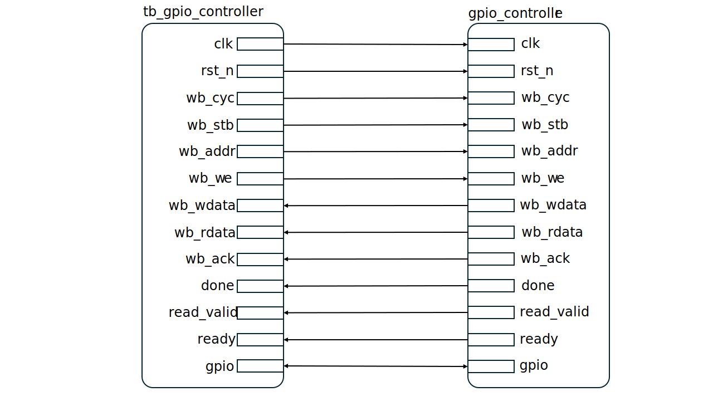

# GPIOコントローラおよびテストベンチ説明書

## 対象ファイル
- `gpio_controller.v`: GPIOコントローラ
- `tb_gpio_controller.v`: 検証用テストベンチ

## 回路概要
本回路は、WISHBONE-style bus を介して GPIO の入出力方向、出力値、および入力値の読み出しを制御する 8 bit GPIO コントローラである。

GPIO は、外部回路と 0 または 1 のデジタル信号をやり取りするための汎用入出力端子である。本回路では、gpio[7:0] の 8 本の GPIO ピンを使用する。

## 実装する処理仕様の概要
本回路では、wb_addr により操作対象を切り替える。

- wb_addr=0: GPIO の方向設定を扱う。
- wb_addr=1: GPIO の出力値設定または GPIO 状態読み出しを扱う。

書き込み時は wb_we=1 とし、wb_wdata の値を内部レジスタへ書き込む。wb_addr=0 の場合は direction_reg に書き込み、wb_addr=1 の場合は output_reg に書き込む。

読み出し時は wb_we=0 とし、wb_rdata から値を読み出す。wb_addr=0 の場合は direction_reg の値を読み出し、wb_addr=1 の場合は GPIO ピン状態を読み出す。

## 構成図（ブロック図）

## `gpio_controller.v`
### 入力信号
- `clk`: クロック信号
- `rst_n`: Low有効リセット信号
- `wb_cyc`: バスサイクルが有効であることを示す信号
- `wb_stb`: バス転送要求が有効であることを示す信号
- `wb_addr`: アクセス対象を選択するアドレス信号
- `wb_we`: 書き込み・読み出しを指定する信号。`1` で書き込み、`0` で読み出し
- `wb_wdata[7:0]`: 書き込みデータ

### 出力信号
- `wb_rdata[7:0]`: 読み出しデータ
- `wb_ack`: Wishbone バスアクセスに対する応答信号
- `direction_reg[7:0]`:GPIO方向設定を保持する観測用出力
- `output_reg[7:0]`: GPIO出力値を保持する観測用出力
- `input_data[7:0]`: GPIO状態読み出し時の値を保持する観測用出力
- `read_valid`: GPIO状態読み出し値が有効であることを示す
- `done`: バスアクセス完了を示す
- `busy`: バスアクセス処理中を示す
- `ready`: 次のバスアクセスを受け付け可能であることを示す

### 双方向信号
- `gpio[7:0]`: 外部回路と接続される双方向GPIOピン

### 内部レジスタ
- `gpio_sample_1[7:0]`: GPIOピン状態を1段目で取り込むレジスタ
- `gpio_sample_2[7:0]`: GPIOピン状態を2段目で取り込むレジスタ
- `read_value[7:0]`: GPIO状態読み出し時に一時的に使用される値

### 内部信号
- `bus_access`: wb_cyc & wb_stb。バスアクセスが有効であることを示す
- `bus_accept`: bus_access & ~wb_ack。DUTがそのアクセスを受け付ける条件
- `bus_write`: bus_accept & wb_we。書き込みアクセスを示す

### 機能
- `rst_n=0` のとき、リセット状態となる。
- リセット時には、`direction_reg`、`output_reg`、`input_data`、`wb_rdata`、`wb_ack`、`read_valid`、`done` を初期化する。
- `wb_cyc=1` かつ `wb_stb=1` のとき、WISHBONE-style bus アクセスを受け付ける。
- バスアクセスを受け付けたとき、応答信号として `wb_ack` を出力する。
- バスアクセスを受け付けたとき、アクセス完了信号として `done` を出力する。
- `wb_we=1` かつ `wb_addr=0` のとき、`wb_wdata` の値を `direction_reg` に書き込む。
- `wb_we=1` かつ `wb_addr=1` のとき、`wb_wdata` の値を `output_reg` に書き込む。
- `wb_we=0` かつ `wb_addr=0` のとき、`direction_reg` の値を `wb_rdata` に出力する。
- `wb_we=0` かつ `wb_addr=1` のとき、GPIO ピン状態を取り込んだ値を `wb_rdata` に出力する。
- GPIO 状態読み出し時には、読み出し値を input_data に保持する。
- GPIO 状態読み出し時には、読み出し値が有効であることを示す `read_valid` を出力する。
- `direction_reg[n]=1` の GPIO ピンでは、`output_reg[n]` の値を `gpio[n]` へ出力する。
- `direction_reg[n]=0` の GPIO ピンでは、`gpio[n]` をハイインピーダンス状態とし、DUT 側からは駆動しない。
- GPIO ピンの値を `gpio_sample_1`、`gpio_sample_2` の 2 段のレジスタに順に取り込む。
- `busy` により、バスアクセス処理中であることを示す。
- `ready` により、次のバスアクセスを受け付け可能であることを示す。

### シミュレーションログ出力
- リセット時の初期化状態をログに出力する。
- direction register 書き込み時の実行パスをログに出力する。
- output register 書き込み時の実行パスをログに出力する。
- direction register 読み出し時の読み出し値をログに出力する。
- GPIO状態読み出し時の読み出し値をログに出力する。

### エラー動作
- 本回路には、専用のエラー出力信号は存在しない。

### 主要ステータス信号とテスト内容
#### `wb_ack` の応答確認
意味:
- `wb_ack` は、WISHBONE-style bus アクセスに対する応答信号である。
- `wb_cyc=1` かつ `wb_stb=1` の有効アクセスをDUTが受け付けたことを示す。

テスト内容:
- `CASE1` から　`CASE4`
  - direction register 書き込み時に `wb_ack=1` となることを確認する。
  - output register 書き込み時に `wb_ack=1` となることを確認する。
  - direction register 読み出し時に `wb_ack=1` となることを確認する。
  - GPIO状態読み出し時に `wb_ack=1` となることを確認する。

- `CASE5` , `CASE6`
  - 無効バスアクセス時に `wb_ack=0`

- `CASE9`
  - リセット入力時に `wb_ack=0`へ初期化されることを確認する

#### `done` のアクセス完了確認
意味:
- `done` は、バスアクセスの完了を示す信号である。
- DUT が書き込みまたは読み出しアクセスを受け付けたときに 1 となる。

テスト内容:
- `CASE1` から `CASE4`
  - 有効な書き込みおよび読み出しアクセス時に `done=1` となることを確認する。
- `CASE5` 、 `CASE6`
  - 無効バスアクセス時に `done=0` となることを確認する。
- `CASE9`
  - リセット入力時に `done=0` へ初期化されることを確認する。

#### `read_valid` のGPIO状態読み出し確認
意味:
- `read_valid` は、GPIO 状態読み出し値が有効であることを示す信号である。
- `wb_addr=1` かつ `wb_we=0` の GPIO 状態読み出し時に `1` となる。

テスト内容:
- `CASE1` から `CASE4`
  - GPIO状態読み出し時に `read_valid=1` となることを確認する。
  - `wb_rdata` および `input_data` が期待値と一致することを確認する。
- `CASE9`
  - リセット入力時に `read_valid=0` へ初期化されることを確認する。

#### `busy` のバス処理中確認
意味:
- `busy` は、DUT がバスアクセス処理中であることを示す信号である。
- `wb_cyc=1` かつ `wb_stb=1` で、まだ応答が返っていない状態を示す。

テスト内容:
- `CASE1` から `CASE4`
  - バスアクセス中に `busy` の変化を波形で確認する。
- `CASE5` 、`CASE6`
  - 無効バスアクセス時に `busy=0` となることを確認する。

#### `ready` の受付可能状態確認
意味:
- `ready` は、DUT が次のバスアクセスを受け付け可能であることを示す信号である。
- `busy` の反対の意味を持ち、バス処理中でないときに `1` となる。。

テスト内容:
- `RESET`
  - リセット解除後に `ready=1` となることを確認する。
- `CASE1` から `CASE4`
  - 各バスアクセス完了後に `ready=1` へ戻ることを確認する。
- `CASE5` 、`CASE6`
  - 無効バスアクセス時に `ready=1` を維持することを確認する。
- CASE9
  - リセット解除後に `ready=1` となることを確認する。

## `tb_gpio_controller.v`
### 目的
- 主要機能を一通り検証する
- 実行パスをシミュレーションログに残す
- 回路の入出力値をシミュレーションログに残す

### テストケース
- `RESET`: リセット後の初期状態の確認
- `CASE1`: 下位4bit出力・上位4bit入力の確認
- `CASE2`: 上位4bit出力・下位4bit入力の確認
- `CASE3`: 全GPIO入力の確認
- `CASE4`: 全GPIO出力の確認
- `CASE5`: wb_cyc のみ有効な無効アクセスの確認
- `CASE6`: wb_stb のみ有効な無効アクセスの確認
- `CASE7`: 動作途中リセットの確認

### Vivado Wave で観測すべき主な信号
- `clk`
- `rst_n`
- `wb_cyc`
- `wb_stb`
- `wb_addr`
- `wb_we`
- `wb_wdata[7:0]`
- `wb_rdata[7:0]`
- `wb_ack`
- `gpio[7:0]`
- `direction_reg[7:0]`
- `output_reg[7:0]`
- `input_data[7:0]`
- `read_valid`
- `done`
- `busy`
- `ready`
