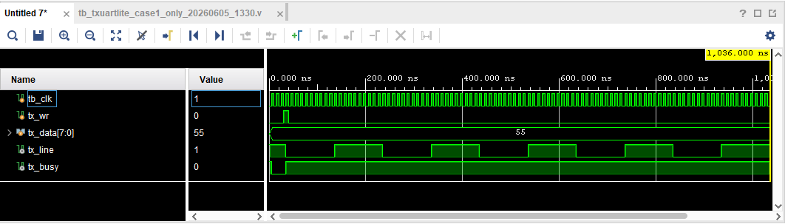

# RS-232回路 評価報告書

## 評価対象
- 対象回路:
  - `txuartlite.v`
- テストベンチ:
  - `tb_txuartlite.v`

## 評価目的
- `txuartlite.v` が、期待値表どおりに動作することを確認する。
- シミュレーションログから、以下の両方が判別できることを確認する。
  - 回路の入出力値
  - 回路本体およびテストベンチの実行パス

## 評価項目
- 正常送信
  - `8'h00` の正常送信
  - `8'hFF` の正常送信
  - `8'h55` の正常送信
  - `8'hAA` の正常送信
- `tx_busy=1` 中に `tx_wr=1` を入力した場合の書き込み無視動作

## 合格条件
- `tb_txuartlite.v` 内のチェックで `TB_FAIL` が 0 件であること
- 最終サマリに `fail=0` と表示されること
- 最終結果に `TB_RESULT: PASS` と表示されること。
- シミュレーションログに `TB_PATH`、`TB_CASE`、`TB_INFO`、`TB_PASS`、`TB_DUT_PATH` が含まれること

## Vivadoでの実行手順
1. Vivado プロジェクトを開く。
2. `tb_txuartlite.v` を simulation top に設定する。
3. Behavioral Simulation を実行する。
4. Console ログを保存する。
5. 以下の信号を含む波形を保存する。
   - `tx_line`
   - `tx_data`
   - `tx_wr`
   - `tx_busy`


## シミュレーションログ
Vivado 実行時のログを以下に示す。

```text

```

## 評価結果まとめ
### CASE1 正常送信(0x00)
| 項目 | 入力条件 | 期待値 | 実測値 | 判定 |
| --- | --- | --- | --- | --- |
| 送受信 | `pulse_start(8'h28)` | `rx_data=8'h28` | `rx_data=8'h28` | 合格 |
| 受信完了 | `pulse_start(8'h28)` | `rx_done=1` | `rx_done=1` | 合格 |

### CASE2 正常送信(0xFF)
| 項目 | 入力条件 | 期待値 | 実測値 | 判定 |
| --- | --- | --- | --- | --- |

### CASE3 正常送信(0x55)
| 項目 | 入力条件 | 期待値 | 実測値 | 判定 |
| --- | --- | --- | --- | --- |

### CASE4 正常送信(0xAA)
| 項目 | 入力条件 | 期待値 | 実測値 | 判定 |
| --- | --- | --- | --- | --- |

### CASE5 正常送受信
| 項目 | 入力条件 | 期待値 | 実測値 | 判定 |
| --- | --- | --- | --- | --- |

### 総括
| 項目 | 結果 |
| --- | --- |
| 総判定 | 合格 |
| 判定数 | `pass=17` |
| 不合格数 | `fail=0` |
| 結論 | 対象回路の主要機能は期待値どおりに動作したことを確認した |

## 波形キャプチャ貼付欄

### 図1 正常送受信波形
- 対象ケース: CASE1
- 推奨表示信号:
  - `tx_line`
  - `tx_data`
  - `tx_wr`
  - `tx_busy`
- 推奨表示時間帯: `1.0 us` から `1.2 us`
- 説明:
  - 正常な送受信により `rx_data=0x28`、`rx_done=1` となることを確認した。



### 図2 正常送受信波形
- 対象ケース: CASE2
- 推奨表示信号:
  - `tx_line`
  - `tx_data`
  - `tx_wr`
  - `tx_busy`
- 推奨表示時間帯: `1.0 us` から `1.2 us`
- 説明:
  - 正常な送受信により `rx_data=0x28`、`rx_done=1` となることを確認した。


### 図3 正常送受信波形
- 対象ケース: CASE3
- 推奨表示信号:
  - `tx_line`
  - `tx_data`
  - `tx_wr`
  - `tx_busy`
- 推奨表示時間帯: `1.0 us` から `1.2 us`
- 説明:
  - 正常な送受信により `rx_data=0x28`、`rx_done=1` となることを確認した。


### 図4 正常送受信波形
- 対象ケース: CASE4
- 推奨表示信号:
  - `tx_line`
  - `tx_data`
  - `tx_wr`
  - `tx_busy`
- 推奨表示時間帯: `1.0 us` から `1.2 us`
- 説明:
  - 正常な送受信により `rx_data=0x28`、`rx_done=1` となることを確認した。


### 図5 正常送受信波形
- 対象ケース: CASE5
- 推奨表示信号:
  - `tx_line`
  - `tx_data`
  - `tx_wr`
  - `tx_busy`
- 推奨表示時間帯: `1.0 us` から `1.2 us`
- 説明:
  - 正常な送受信により `rx_data=0x28`、`rx_done=1` となることを確認した。

