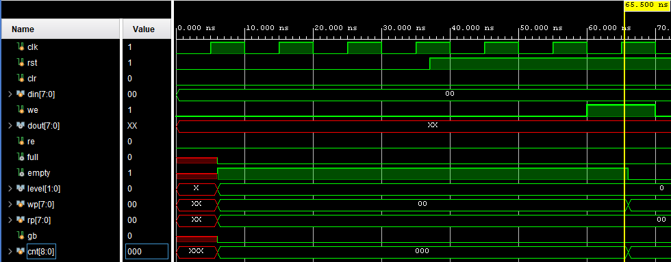
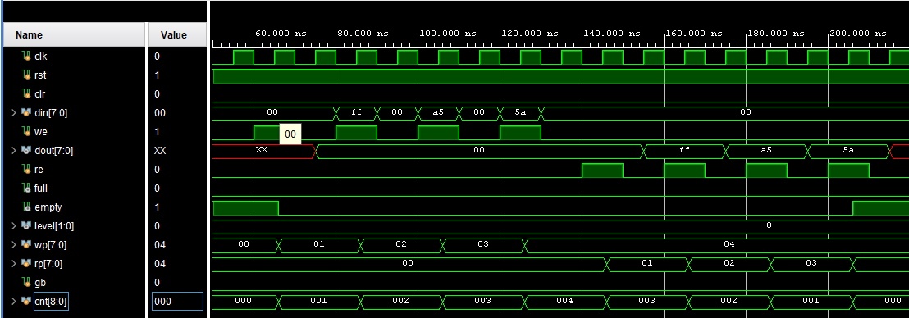
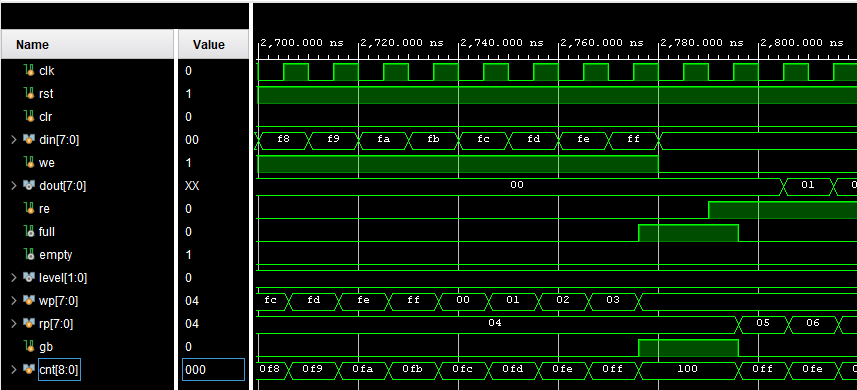
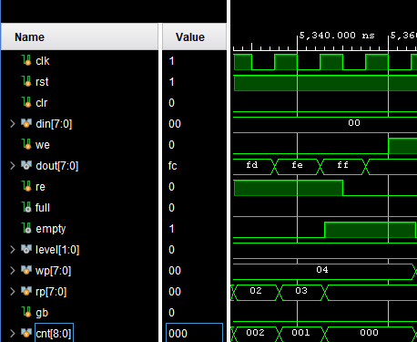
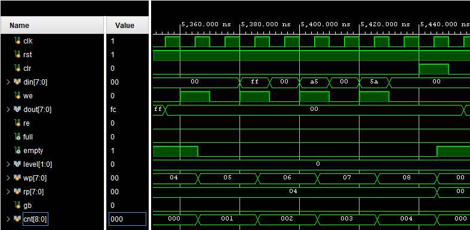

# FIFO同期回路 評価報告書

## 評価対象
- 対象回路:
  - `generic_fifo_sc_a.v`
- 補助回路:
  - `generic_dpram.v`
  - `timescale.v`
- テストベンチ:
  - `tb_generic_fifo_sc_a_20260616_1449.v`

## 評価目的
- FIFO同期回路が、期待値表どおりに動作することを確認する。
- シミュレーションログから、以下の両方が判別できることを確認する。
  - 回路の入出力値
  - 回路本体およびテストベンチの実行パス

## 評価項目
- リセット後の初期状態確認
- 基本 FIFO 動作確認
- `full` 状態と `empty` 状態からの復帰確認
- `clr` によるクリア確認
- 書き込み順序と読み出し順序の一致確認

## 合格条件
- `tb_generic_fifo_sc_a.v` 内のチェックで `TB_FAIL` が 0 件であること
- 最終サマリに `fail=0` と表示されること
- `RESET`、`CASE1`、`CASE2`、`CASE3` の各テストケースで `TB_PASS` が表示されること

## Vivadoでの実行手順
1. Vivado プロジェクトを開く。
2. `tb_generic_fifo_sc_a.v` を simulation top に設定する。
3. Behavioral Simulation を実行する。
4. Console ログを保存する。
5. 以下の信号を含む波形を保存する。
   - `clk`
   - `rst`
   - `clr`
   - `din`
   - `we`
   - `dout`
   - `re`
   - `full`
   - `empty`
   - `level`
   - `wp`
   - `rp`
   - `gb`
   - `cnt`

## シミュレーションログ
Vivado 実行時のログを以下に示す。

```text
[0] TB_PATH: simulation start
[0] TB_INFO: DUT=generic_fifo_sc_a dw=8 aw=8 n=32 depth=256
[0] TB_PATH: reset sequence start
[37000] TB_INFO: during reset din=0x00 dout=0xxx we=0 re=0 full=0 empty=1 wp=0x00 rp=0x00 gb=0 cnt=0 level=0
[57000] TB_PATH: reset released
[57000] TB_INFO: after reset din=0x00 dout=0xxx we=0 re=0 full=0 empty=1 wp=0x00 rp=0x00 gb=0 cnt=0 level=0
[57000] TB_PASS: RESET empty must be 1
[57000] TB_PASS: RESET full must be 0
[57000] TB_PASS: RESET wp must equal rp
[57000] TB_PASS: RESET gb must be 0
[57000] TB_PASS: RESET cnt must be 0 actual=0 expected=0
[57000] TB_PATH: CASE1 basic FIFO operation start
[57000] TB_INFO: CASE1 write sequence = 00, FF, A5, 5A
[60000] TB_CASE: CASE1 write data=0x00
[67000] TB_INFO: after write_one din=0x00 dout=0xxx we=1 re=0 full=0 empty=0 wp=0x01 rp=0x00 gb=0 cnt=1 level=0
[80000] TB_CASE: CASE1 write data=0xff
[87000] TB_INFO: after write_one din=0xff dout=0x00 we=1 re=0 full=0 empty=0 wp=0x02 rp=0x00 gb=0 cnt=2 level=0
[100000] TB_CASE: CASE1 write data=0xa5
[107000] TB_INFO: after write_one din=0xa5 dout=0x00 we=1 re=0 full=0 empty=0 wp=0x03 rp=0x00 gb=0 cnt=3 level=0
[120000] TB_CASE: CASE1 write data=0x5a
[127000] TB_INFO: after write_one din=0x5a dout=0x00 we=1 re=0 full=0 empty=0 wp=0x04 rp=0x00 gb=0 cnt=4 level=0
[130000] TB_PASS: CASE1 empty must be 0 after four writes
[130000] TB_PASS: CASE1 full must be 0 after four writes
[130000] TB_PASS: CASE1 cnt must be 4 after four writes actual=4 expected=4
[140000] TB_CASE: CASE1 read order check read expected=0x00
[148000] TB_PASS: CASE1 read order check actual=0x00 expected=0x00
[148000] TB_INFO: after read_one_check din=0x00 dout=0x00 we=0 re=1 full=0 empty=0 wp=0x04 rp=0x01 gb=0 cnt=3 level=0
[160000] TB_CASE: CASE1 read order check read expected=0xff
[168000] TB_PASS: CASE1 read order check actual=0xff expected=0xff
[168000] TB_INFO: after read_one_check din=0x00 dout=0xff we=0 re=1 full=0 empty=0 wp=0x04 rp=0x02 gb=0 cnt=2 level=0
[180000] TB_CASE: CASE1 read order check read expected=0xa5
[188000] TB_PASS: CASE1 read order check actual=0xa5 expected=0xa5
[188000] TB_INFO: after read_one_check din=0x00 dout=0xa5 we=0 re=1 full=0 empty=0 wp=0x04 rp=0x03 gb=0 cnt=1 level=0
[200000] TB_CASE: CASE1 read order check read expected=0x5a
[208000] TB_PASS: CASE1 read order check actual=0x5a expected=0x5a
[208000] TB_INFO: after read_one_check din=0x00 dout=0x5a we=0 re=1 full=0 empty=1 wp=0x04 rp=0x04 gb=0 cnt=0 level=0
[210000] TB_PASS: CASE1 after all reads empty must be 1
[210000] TB_PASS: CASE1 after all reads full must be 0
[210000] TB_PASS: CASE1 after all reads wp must equal rp
[210000] TB_PASS: CASE1 after all reads gb must be 0
[210000] TB_PASS: CASE1 after all reads cnt must be 0 actual=0 expected=0
[210000] TB_PATH: CASE2 full guard empty return start
[210000] TB_INFO: CASE2 write din=i[7:0] for i=0..255
[220000] TB_CASE: CASE2 write index=0 data=0x00
[230000] TB_CASE: CASE2 write index=1 data=0x01
[240000] TB_CASE: CASE2 write index=2 data=0x02
[250000] TB_CASE: CASE2 write index=3 data=0x03
[2740000] TB_CASE: CASE2 write index=252 data=0xfc
[2750000] TB_CASE: CASE2 write index=253 data=0xfd
[2760000] TB_CASE: CASE2 write index=254 data=0xfe
[2770000] TB_CASE: CASE2 write index=255 data=0xff
[2787000] TB_INFO: CASE2 after 256 writes din=0x00 dout=0x00 we=0 re=0 full=1 empty=0 wp=0x04 rp=0x04 gb=1 cnt=256 level=11
[2787000] TB_PASS: CASE2 full must be 1 after 256 writes
[2787000] TB_PASS: CASE2 empty must be 0 after 256 writes
[2787000] TB_PASS: CASE2 cnt must be 256 after 256 writes actual=256 expected=256
[2787000] TB_PASS: CASE2 full state wp must equal rp
[2787000] TB_PASS: CASE2 full state gb must be 1
[2790000] TB_CASE: CASE2 read index=0 expected=0x00
[2800000] TB_CASE: CASE2 read index=1 expected=0x01
[2810000] TB_CASE: CASE2 read index=2 expected=0x02
[2820000] TB_CASE: CASE2 read index=3 expected=0x03
[5310000] TB_CASE: CASE2 read index=252 expected=0xfc
[5320000] TB_CASE: CASE2 read index=253 expected=0xfd
[5330000] TB_CASE: CASE2 read index=254 expected=0xfe
[5340000] TB_CASE: CASE2 read index=255 expected=0xff
[5357000] TB_INFO: CASE2 after 256 reads din=0x00 dout=0x00 we=0 re=0 full=0 empty=1 wp=0x04 rp=0x04 gb=0 cnt=0 level=0
[5357000] TB_PASS: CASE2 all 256 read values must match write order
[5357000] TB_PASS: CASE2 after all reads empty must be 1
[5357000] TB_PASS: CASE2 after all reads full must be 0
[5357000] TB_PASS: CASE2 after all reads wp must equal rp
[5357000] TB_PASS: CASE2 after all reads gb must be 0
[5357000] TB_PASS: CASE2 after all reads cnt must be 0 actual=0 expected=0
[5357000] TB_PATH: CASE3 clr behavior start
[5357000] TB_INFO: CASE3 pre-clear write sequence = 00, FF, A5, 5A
[5360000] TB_CASE: CASE3 pre-clear write data=0x00
[5367000] TB_INFO: after write_one din=0x00 dout=0x00 we=1 re=0 full=0 empty=0 wp=0x05 rp=0x04 gb=0 cnt=1 level=0
[5380000] TB_CASE: CASE3 pre-clear write data=0xff
[5387000] TB_INFO: after write_one din=0xff dout=0x00 we=1 re=0 full=0 empty=0 wp=0x06 rp=0x04 gb=0 cnt=2 level=0
[5400000] TB_CASE: CASE3 pre-clear write data=0xa5
[5407000] TB_INFO: after write_one din=0xa5 dout=0x00 we=1 re=0 full=0 empty=0 wp=0x07 rp=0x04 gb=0 cnt=3 level=0
[5420000] TB_CASE: CASE3 pre-clear write data=0x5a
[5427000] TB_INFO: after write_one din=0x5a dout=0x00 we=1 re=0 full=0 empty=0 wp=0x08 rp=0x04 gb=0 cnt=4 level=0
[5430000] TB_PASS: CASE3 empty must be 0 before clr
[5430000] TB_PASS: CASE3 cnt must be 4 before clr actual=4 expected=4
[5440000] TB_CASE: CASE3 clr=1
[5447000] TB_INFO: after clr active edge din=0x00 dout=0x00 we=0 re=0 full=0 empty=1 wp=0x00 rp=0x00 gb=0 cnt=0 level=0
[5457000] TB_INFO: after clr released din=0x00 dout=0xfc we=0 re=0 full=0 empty=1 wp=0x00 rp=0x00 gb=0 cnt=0 level=0
[5457000] TB_PASS: CASE3 after clr empty must be 1
[5457000] TB_PASS: CASE3 after clr full must be 0
[5457000] TB_PASS: CASE3 after clr wp must equal rp
[5457000] TB_PASS: CASE3 after clr gb must be 0
[5457000] TB_PASS: CASE3 after clr cnt must be 0 actual=0 expected=0
[5457000] TB_SUMMARY: pass=35 fail=0
[5457000] TB_PATH: simulation finished with PASS
```

## 評価結果まとめ
### RESET リセット後の初期状態確認
| 項目 | 入力条件 | 期待値 | 実測値 | 判定 |
| --- | --- | --- | --- | --- |
| `empty` | リセット後 | `1` | `1` | 合格 |
| `full` | リセット後 | `0` | `0` | 合格 |
| `wp` と `rp` | リセット後 | `wp==rp` | `wp=8'h00`, `rp=8'h00` | 合格 |
| `gb` | リセット後 | `0` | `0` | 合格 |
| `cnt` | リセット後 | `0` | `0` | 合格 |

### CASE1 基本 FIFO 動作確認
| 項目 | 入力条件 | 期待値 | 実測値 | 判定 |
| --- | --- | --- | --- | --- |
| 書き込み後の empty | `8'h00`, `8'hFF`, `8'hA5`, `8'h5A` を書き込み | `empty=0` | `empty=0` | 合格 |
| 1個目の読み出し | 1回目 read | `dout=8'h00` | `dout=8'h00` | 合格 |
| 2個目の読み出し | 2回目 read | `dout=8'hFF` | `dout=8'hFF` | 合格 |
| 3個目の読み出し | 3回目 read | `dout=8'hA5` | `dout=8'hA5` | 合格 |
| 4個目の読み出し | 4回目 read | `dout=8'h5A` | `dout=8'h5A` | 合格 |
| 全読み出し後の empty | 4個すべて読み出し後 | `empty=1` | `empty=1` | 合格 |

### CASE2 full状態とempty状態からの復帰確認
| 項目 | 入力条件 | 期待値 | 実測値 | 判定 |
| --- | --- | --- | --- | --- |
| full 到達 | `8'h00` から `8'hFF` まで256個書き込み | `full=1` | `full=1` | 合格 |
| full 後の最初の読み出し | full 状態から1個 read | `dout=8'h00` | `dout=8'h00` | 合格 |
| full 解除 | 1個 read 後 | `full=0` | `full=0` | 合格 |
| 残りデータの順序 | `8'h01` から `8'hFE` を読み出し | 連続データが順番に一致 | 一致 | 合格 |
| 最後の読み出し | 最後の read | `dout=8'hFF` | `dout=8'hFF` | 合格 |
| empty 復帰 | 全データ読み出し後 | `empty=1` | `empty=1` | 合格 |

### CASE3 `clr` によるクリア確認
| 項目 | 入力条件 | 期待値 | 実測値 | 判定 |
| --- | --- | --- | --- | --- |
| クリア前状態 | `8'h00`, `8'hFF`, `8'hA5`, `8'h5A` を書き込み | `empty=0` | `empty=0` | 合格 |
| clr 入力後 | `clr=1` を入力 | `wp=0`, `rp=0`, `full=0`, `empty=1` | `wp=0`, `rp=0`, `full=0`, `empty=1` | 合格 |

### 総括
| 項目 | 結果 |
| --- | --- |
| 総判定 | 合格 |
| 判定数 | `pass=35` |
| 不合格数 | `fail=0` |
| 結論 | 対象回路の主要機能は期待値どおりに動作したことを確認した |

## 波形キャプチャ貼付欄

### 図1 RESET確認波形
- 対象ケース: RESET
- 推奨表示信号:
  - `clk`
  - `rst`
  - `clr`
  - `din`
  - `we`
  - `dout`
  - `re`
  - `full`
  - `empty`
  - `level`
  - `wp`
  - `rp`
  - `gb`
  - `cnt`
- 推奨表示時間帯: `0 ns` から `70 ns`
- 説明:
  - リセット後に `empty=1`、`full=0`、`wp=0x00`、`rp=0x00`、`gb=0`、`cnt=0` となることを確認した。


### 図2 基本FIFO動作波形
- 対象ケース: CASE1
- 推奨表示信号:
  - `clk`
  - `rst`
  - `clr`
  - `din`
  - `we`
  - `dout`
  - `re`
  - `full`
  - `empty`
  - `level`
  - `wp`
  - `rp`
  - `gb`
  - `cnt`
- 推奨表示時間帯: `50 ns` から `220 ns`
- 説明:
  - `8'h00`、`8'hFF`、`8'hA5`、`8'h5A` を順に書き込み、同じ順序で読み出されることを確認した。



### 図3 CASE2 full確認波形
- 対象ケース: CASE2
- 推奨表示信号:
  - `clk`
  - `rst`
  - `clr`
  - `din`
  - `we`
  - `dout`
  - `re`
  - `full`
  - `empty`
  - `level`
  - `wp`
  - `rp`
  - `gb`
  - `cnt`
- 推奨表示時間帯: `2700 ns` から `2820 ns`
- 説明:
  - 256個書き込み後に `full=1`、`empty=0`、`wp==rp`、`gb=1`、`cnt=256` となることを確認した。


### 図4 empty確認波形
- 対象ケース: CASE2
- 推奨表示信号:
  - `clk`
  - `rst`
  - `clr`
  - `din`
  - `we`
  - `dout`
  - `re`
  - `full`
  - `empty`
  - `level`
  - `wp`
  - `rp`
  - `gb`
  - `cnt`
- 推奨表示時間帯: `5280 ns` から `5370 ns`
- 説明:
  - 256個読み出し後に `empty=1`、`full=0`、`wp==rp`、`gb=0`、`cnt=0` となることを確認した。



### 図5 CLR確認波形
- 対象ケース: CASE3
- 推奨表示信号:
  - `clk`
  - `rst`
  - `clr`
  - `din`
  - `we`
  - `dout`
  - `re`
  - `full`
  - `empty`
  - `level`
  - `wp`
  - `rp`
  - `gb`
  - `cnt`
- 推奨表示時間帯: `5350 ns` から `5450 ns`
- 説明:
  - `clr=1` 入力により、`empty=1`、`full=0`、`wp=0x00`、`rp=0x00`、`gb=0`、`cnt=0` となることを確認した。
