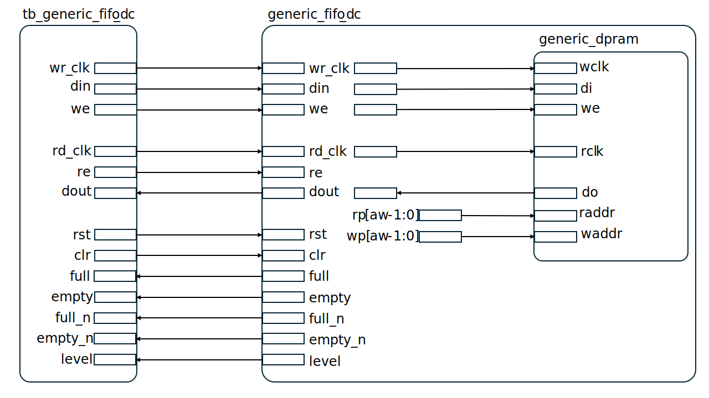
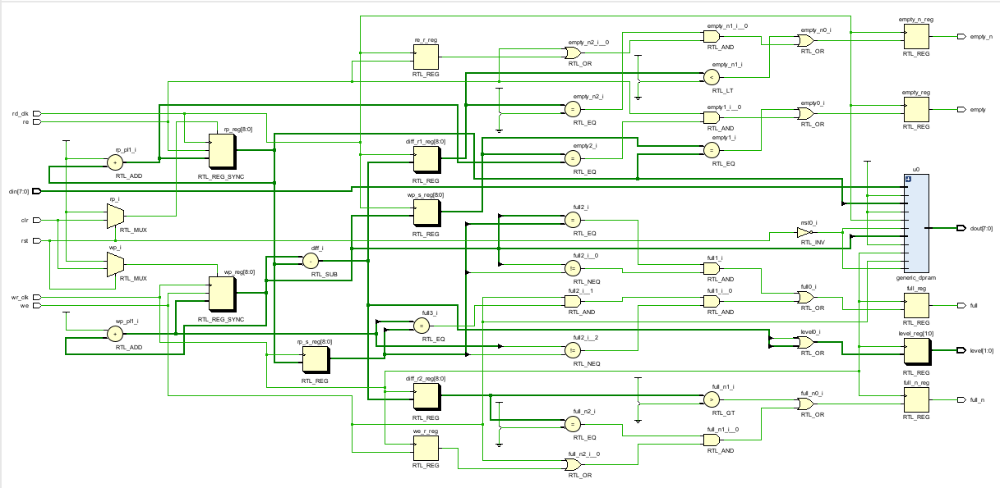
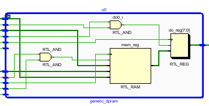

# FIFO非同期回路およびテストベンチ説明書

## 対象ファイル
- `generic_fifo_dc.v`: FIFO非同期回路
- `generic_dpram.v`: FIFO内部で使用されるデュアルポートRAM
- `timescale.v`: シミュレーション時間単位の設定ファイル
- `tb_generic_fifo_dc.v`: 検証用テストベンチ

## 回路概要

本回路は、OpenCores の `generic_fifos` に含まれる FIFO非同期回路である。FIFO は First-In First-Out の略であり、先に書き込んだデータを先に読み出すためのバッファ回路である。実際の機器では、CPUと周辺機器の間、UARTやSPIなどの通信回路の送受信バッファなどに使われる。

今回対象とする `generic_fifo_dc.v` は、書き込みと読み出しを異なるクロック `rd_clk` 読み出し側クロックと`wr_clk`書き込み側クロックに同期して行う dual clock FIFO である。外部から `din` に入力されたデータは、`we` が有効なクロックで FIFO 内部のメモリへ書き込まれる。また、`re` が有効なクロックで、FIFO に保存されているデータが書き込み順に `dout` へ読み出される。

本回路では、FIFO内部のデータ格納部として `generic_dpram.v` を使用する。`generic_fifo_dc.v` は、書き込み位置を示す `wp`、読み出し位置を示す `rp` を用いて FIFO の状態を管理する。

## 実装する処理仕様の概要
本回路のデフォルトパラメータは以下の通りである。

`dw = 8`
`aw = 8`
`n  = 32`

各パラメータの意味は以下の通りである。

- `dw`: 1要素あたりのデータ幅を示す
- `aw `: FIFOのアドレス幅を示す。
- `n `: `full_n` および `empty_n` のしきい値判定に使用される値である。

今回の設定では、`dw=8`、`aw=8` であるため、FIFOの構成は以下のようになる。

1要素のデータ幅: 8bit
保存可能な要素数: 2^8 = 256個
FIFO全体の記憶容量: 8bit × 256個 = 2048bit

ここで、FIFO容量が256であるということは、256bitのデータを1回で入力できるという意味ではない。1回の書き込みでは、`din[7:0]` の8bitデータを1要素として FIFO へ格納する。この8bitデータ要素を最大256個まで保存できるという意味である。

FIFOの基本動作は以下の通りである。

- `we=1` のクロックで、`din` の値を FIFO に書き込む。
- `re=1` のクロックで、FIFO に保存されているデータを `dout` へ読み出す。
- 書き込み時には `wp` が進み、読み出し時には `rp` が進む。
- FIFOが空のときは `empty=1` となる。
- FIFOが満杯のときは `full=1` となる。

## 構成図（ブロック図）

## 回路図

## `generic_fifo_dc.v`
### 入力信号
- `rd_clk`: 読み出し側クロック
- `wr_clk`: 書き込み側クロック
- `rst`: リセット信号。Low active
- `clr`: 同期クリア信号。High active
- `din[dw-1:0]`: FIFO に書き込む入力データ
- `we`: 書き込み許可信号。wr_clk に同期して動作する
- `re`: 読み出し許可信号。rd_clk に同期して動作する

### 出力信号
- `dout[dw-1:0] `: FIFO から読み出された出力データ
- `full`: FIFO が満杯であることを示すフラグ
- `empty`: FIFO が空であることを示すフラグ
- `full_n`: FIFO が full に近い状態であることを示す補助フラグ
- `empty_n`: FIFO が empty に近い状態であることを示す補助フラグ
- `level[1:0]`: FIFO 使用量の目安を示す信号

### 内部レジスタ
- `wp`: write pointer。次に書き込む位置を示す
- `rp`: read pointer。次に読み出す位置を示す
- `wp_s`: 読み出し側クロックに同期された write pointer
- `rp_s`: 書き込み側クロックに同期された read pointer
- `wp_pl1`: `wp + 1` を表す信号
- `rp_pl1`: `rp + 1` を表す信号
- `diff`: `wp - rp` により FIFO 内のデータ量を求めるための信号
- `diff_r1`, `diff_r2`: diff を各クロック側で保持するためのレジスタ
- `re_r`: 読み出し許可信号 `re` を保持するレジスタ
- `we_r`: 書き込み許可信号 `we` を保持するレジスタ

### 機能
- `we=1` のとき、`wr_clk` に同期して `din` を `generic_dpram` に書き込む
- 書き込み時に write pointer wp を進める
- `re=1` のとき、`rd_clk` に同期して `generic_dpram` から `dout` へデータを読み出す
- 読み出し時に read pointer rp を進める
- `wp` と `rp` の関係から `full` と `empty` を生成する
- diff を用いて FIFO 使用量の目安である `level` を生成する
- `clr=1` により、`wp` と `rp` を初期状態へ戻す

### 主要ステータス信号とテスト内容
#### `empty`
意味:
- FIFO 内に読み出し可能なデータがないことを示す。
- empty=1 のとき、読み出しを行うと未定義状態になる。

テスト内容:
- `RESET`
  - リセット後に empty=1 となることを確認する。
- `CASE1`
  - データ書き込み後に empty=0 となることを確認する。
  - 全データ読み出し後に empty=1 に戻ることを確認する。
- `CASE2`
  - full 状態から全データを読み出した後に empty=1 となることを確認する。
- `CASE3`
  - clr 入力後に empty=1 となることを確認する。

#### `full`
意味:
- FIFO が満杯であり、これ以上書き込みできないことを示す。
- full=1 のとき、追加書き込みを行うと未定義状態になる。

テスト内容:
- `RESET`
  - リセット後に full=0 となることを確認する。
- `CASE2`
  - 256 個のデータを書き込んだ後に full=1 となることを確認する。
  - 1 個読み出した後に full=0 に戻ることを確認する。
- `CASE3`
  - clr 入力後に full=0 となることを確認する。

#### `dout`
意味:
- FIFO から読み出されたデータを出力する。
- 書き込んだ順番でデータが出力されるかを確認するために用いる。

テスト内容:
- `CASE1`
  - `8'h00`, `8'hFF`, `8'hA5`, `8'h5A` を書き込み、同じ順番で読み出されることを確認する。
- `CASE2`
  - `8'h00` から `8'hFF` までのデータを順番に書き込み、先頭データ `8'h00`、残りの連続データが正しく読み出されることを確認する。

#### `clr`
意味:
- FIFO の内部状態を初期状態へ戻す同期クリア信号である。
- clr=1 により、write pointer と read pointer が 0 に戻る。

テスト内容:
- `CASE3`
  - `8'h5A`, `8'hC3`, `8'h3C`, `8'hA5` を書き込んだ後に `clr=1` を入力する。
  - その後、`wp=0`、`rp=0`、`full=0`、`empty=1` となることを確認する。

## `generic_dpram.v`
generic_dpram.v は、FIFO内部でデータを保存するために使用されるデュアルポートRAMである。

generic_fifo_dc.v は、FIFO全体の状態管理を行う回路であり、実際のデータ保存には generic_dpram.v を使用している。FIFO本体では、書き込みポインタ wp をRAMの書き込みアドレスとして使用し、読み出しポインタ rp をRAMの読み出しアドレスとして使用する。

### 入力信号
- `rclk`: 読み出し側クロック
- `rrst`: 読み出し側リセット
- `rce`: 読み出し側チップイネーブル
- `oe`: 出力イネーブル
- `raddr[aw-1:0]`: 読み出しアドレス
- `wclk`: 書き込み側クロック
- `wrst`: 書き込み側リセット
- `wce`: 書き込み側チップイネーブル
- `we`: 書き込み許可信号
- `waddr[aw-1:0]`: 書き込みアドレス
- `di[dw-1:0]`: 書き込みデータ

### 出力信号
- `do[dw-1:0]`: 読み出しデータ

### 機能
- `wclk` の立ち上がりで、`wce=1` かつ `we=1` のときに `di` を `mem[waddr]` に書き込む
- `rclk` の立ち上がりで、`rce=1` かつ `oe=1` のときに `mem[raddr]` の内容を `do` に出力する
- `generic_fifo_dc.v` からは、書き込みアドレスとして `wp[aw-1:0]`、読み出しアドレスとして `rp[aw-1:0]` が接続される

## `timescale.v`

`timescale.v` は、Verilog シミュレーションにおける時間単位と時間精度を指定するためのファイルである。
本回路では、`generic_fifo_dc.v` および `generic_dpram.v` の先頭で以下のように読み込まれる。
`include "timescale.v"
これにより、各 Verilog ファイルで使用される遅延時間やシミュレーション時刻の単位が統一される。

## `tb_generic_fifo_dc.v`
### 目的
- `generic_fifo_dc.v` の基本的な FIFO 動作を確認する
- 書き込み側クロック `wr_clk` と読み出し側クロック `rd_clk` が分かれている状態で動作を確認する
- 同期 FIFO と比較しやすいように、同じテストケースおよび同じ入力データパターンを使用する
- シミュレーションログから、テストケースの実行パスと合否を確認できるようにする

### テストケース
- `RESET`: リセット後の初期状態確認
- `CASE1`: 基本 FIFO 動作確認
- `CASE2`: full 状態と empty 状態からの復帰確認
- `CASE3`: clr によるクリア確認

### Vivado Wave で観測すべき主な信号
- `rd_clk`
- `wr_clk`
- `rst`
- `clr`
- `din[7:0]`
- `we`
- `dout[7:0]`
- `re`
- `full`
- `empty`
- `full_n`
- `empty_n`
- `level[1:0]`
- `pass_count[31:0]`
- `fail_count[31:0]`