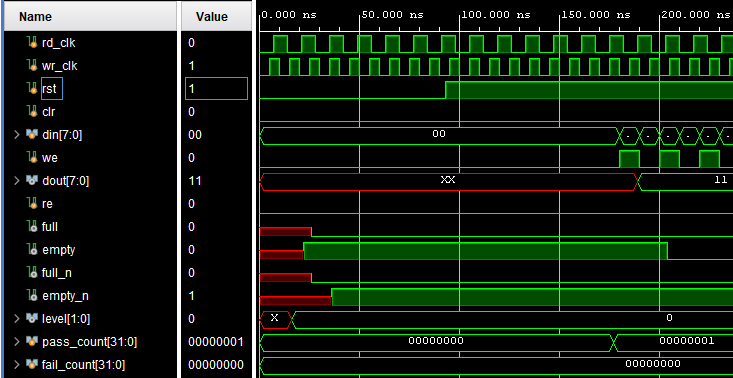
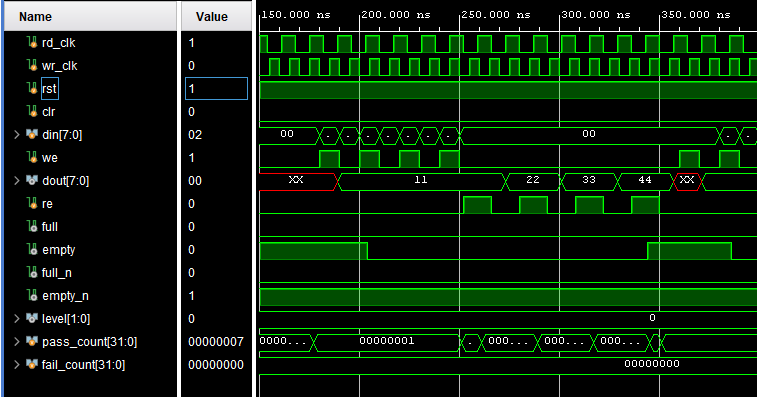
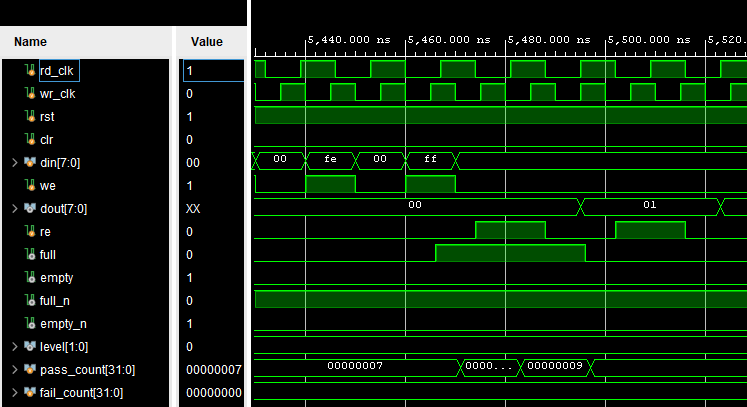
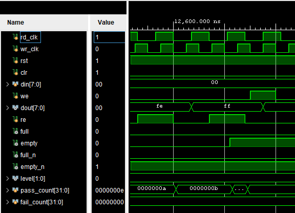

# FIFO非同期回路 評価報告書

## 評価対象
- 対象回路:
  - `generic_fifo_dc.v`
- 補助回路:
  - `generic_dpram.v`
  - `timescale.v`
- テストベンチ:
  - `tb_generic_fifo_dc.v`

## 評価目的
- generic_fifo_dc.v が、期待値表どおりに動作することを確認する。
- 書き込み側クロック wr_clk と読み出し側クロック rd_clk が異なる条件で、FIFO としての基本動作を確認する。
- 同期 FIFO と同じ入力データパターンを用いて、非同期 FIFO でも先入れ先出し動作が成立することを確認する。
- シミュレーションログから、以下の両方が判別できることを確認する。
  - テストベンチの実行パス
  - 各テストケースの合否

## 評価項目
- リセット後の初期状態確認
- 基本 FIFO 動作確認
- `full` 状態と `empty` 状態からの復帰確認
- `clr` によるクリア確認
- 書き込み順序と読み出し順序の一致確認

## 合格条件
- `tb_generic_fifo_dc.v` 内のチェックで `TB_FAIL` が 0 件であること
- 最終サマリに `fail=0` と表示されること
- `RESET`、`CASE1`、`CASE2`、`CASE3` の各テストケースで `TB_PASS` が表示されること

## Vivadoでの実行手順
1. Vivado プロジェクトを開く。
2. `tb_generic_fifo_dc.v` を simulation top に設定する。
3. Behavioral Simulation を実行する。
4. Console ログを保存する。
5. 以下の信号を含む波形を保存する。
   - `rd_clk`
   - `wr_clk`
   - `rst`
   - `clr`
   - `din[7:0]`
   - `we`
   - `dout[7:0]`
   - `re`
   - `full`
   - `empty`
   - `full_n`
   - `empty_n`
   - `level[1:0]`
   - `pass_count[31:0]`
   - `fail_count[31:0]`

## シミュレーションログ
Vivado 実行時のログを以下に示す。

```text
[0] TB_PATH: simulation start
[0] TB_PATH: reset sequence start
[93000] TB_PATH: reset released
[177000] TB_INFO: after reset wp=0 rp=0 full=0 empty=1 level=00
[177000] TB_PATH: RESET initial state check start
[177000] TB_PASS: RESET initial state must be empty
[177000] TB_PATH: RESET initial state check end
[177000] TB_PATH: CASE1 basic FIFO operation start
[177000] TB_CASE: write 00,FF,A5,5A then read in same order
[251000] TB_PASS: CASE1 empty must become 0 after writes
[261000] TB_INFO: read expected=0x00 dout=0x00
[261000] TB_PASS: CASE1 read data must be 0x00
[289000] TB_INFO: read expected=0xff dout=0xff
[289000] TB_PASS: CASE1 read data must be 0xFF
[317000] TB_INFO: read expected=0xa5 dout=0xa5
[317000] TB_PASS: CASE1 read data must be 0xA5
[345000] TB_INFO: read expected=0x5a dout=0x5a
[345000] TB_PASS: CASE1 read data must be 0x5A
[351000] TB_PASS: CASE1 empty must return to 1 after reads
[351000] TB_PATH: CASE1 basic FIFO operation end
[351000] TB_PATH: CASE2 full/empty recovery start
[351000] TB_CASE: write 00-FF then read 00-FF
[5471000] TB_PASS: CASE2 full must become 1 after 256 writes
[5483000] TB_INFO: read expected=0x00 dout=0x00
[5483000] TB_PASS: CASE2 first read after full must be 0x00
[5497000] TB_PASS: CASE2 full must return to 0 after one read
[12601000] TB_PASS: CASE2 remaining 0x01-0xFE data must match
[12623000] TB_INFO: read expected=0xff dout=0xff
[12623000] TB_PASS: CASE2 last read data must be 0xFF
[12629000] TB_PASS: CASE2 empty must become 1 after all reads
[12629000] TB_PATH: CASE2 full/empty recovery end
[12629000] TB_PATH: CASE3 clr clear check start
[12629000] TB_CASE: write 00,FF,A5,5A then clear
[12701000] TB_PASS: CASE3 empty must become 0 before clr
[12701000] TB_CASE: pulse_clr
[12903000] TB_PASS: CASE3 clr must clear FIFO state
[12903000] TB_PATH: CASE3 clr clear check end
[12903000] TB_SUMMARY: pass=15 fail=0
[12903000] TB_PATH: simulation finished PASS
```

## 評価結果まとめ
### RESET リセット後の初期状態確認
| 項目 | 入力条件 | 期待値 | 実測値 | 判定 |
| --- | --- | --- | --- | --- |
| write pointer | リセット後 | `wp=0` | `wp=0` | 合格 |
| read pointer | リセット後 | `rp=0` | `rp=0` | 合格 |
| full フラグ | リセット後 | `full=0` | `full=0` | 合格 |
| empty フラグ | リセット後 | `empty=1` | `empty=1` | 合格 |

### CASE1 基本 FIFO 動作確認
| 項目 | 入力条件 | 期待値 | 実測値 | 判定 |
| --- | --- | --- | --- | --- |
| 書き込み後の empty | `8'h00`, `8'hFF`, `8'hA5`, `8'h5A` を書き込み | `empty=0` | `empty=0` | 合格 |
| 1個目の読み出し | 1回目 read | `dout=8'h00` | `dout=8'h00` | 合格 |
| 2個目の読み出し | 2回目 read | `dout=8'hFF` | `dout=8'hFF` | 合格 |
| 3個目の読み出し | 3回目 read | `dout=8'hA5` | `dout=8'hA5` | 合格 |
| 4個目の読み出し | 4回目 read | `dout=8'h5A` | `dout=8'h5A` | 合格 |
| 全読み出し後の empty | 4個すべて読み出し後 | `empty=1` | `empty=1` | 合格 |

### CASE2 full状態とempty状態からの復帰確認
| 項目 | 入力条件 | 期待値 | 実測値 | 判定 |
| --- | --- | --- | --- | --- |
| full 到達 | `8'h00` から `8'hFF` まで256個書き込み | `full=1` | `full=1` | 合格 |
| full 後の最初の読み出し | full 状態から1個 read | `dout=8'h00` | `dout=8'h00` | 合格 |
| full 解除 | 1個 read 後 | `full=0` | `full=0` | 合格 |
| 残りデータの順序 | `8'h01` から `8'hFE` を読み出し | 連続データが順番に一致 | 一致 | 合格 |
| 最後の読み出し | 最後の read | `dout=8'hFF` | `dout=8'hFF` | 合格 |
| empty 復帰 | 全データ読み出し後 | `empty=1` | `empty=1` | 合格 |

### CASE3 `clr` によるクリア確認
| 項目 | 入力条件 | 期待値 | 実測値 | 判定 |
| --- | --- | --- | --- | --- |
| クリア前状態 | `8'h00`, `8'hFF`, `8'hA5`, `8'h5A` を書き込み | `empty=0` | `empty=0` | 合格 |
| clr 入力後 | `clr=1` を入力 | `wp=0`, `rp=0`, `full=0`, `empty=1` | `wp=0`, `rp=0`, `full=0`, `empty=1` | 合格 |

### 総括
| 項目 | 結果 |
| --- | --- |
| 総判定 | 合格 |
| 判定数 | `pass=15` |
| 不合格数 | `fail=0` |
| 結論 | 対象回路の主要機能は期待値どおりに動作したことを確認した |

## 波形キャプチャ貼付欄

### 図1 RESET確認波形
- 対象ケース: RESET
- 推奨表示信号:
  - `rd_clk`
  - `wr_clk`
  - `rst`
  - `clr`
  - `din[7:0]`
  - `we`
  - `dout[7:0]`
  - `re`
  - `full`
  - `empty`
  - `full_n`
  - `empty_n`
  - `level[1:0]`
  - `pass_count[31:0]`
  - `fail_count[31:0]`
- 推奨表示時間帯: `0 ns` から `200 ns`
- 説明:
  - リセット解除後に `wp=0`、`rp=0`、`full=0`、`empty=1` となることを確認した。



### 図2 基本FIFO動作波形
- 対象ケース: CASE1
- 推奨表示信号:
  - `rd_clk`
  - `wr_clk`
  - `rst`
  - `clr`
  - `din[7:0]`
  - `we`
  - `dout[7:0]`
  - `re`
  - `full`
  - `empty`
  - `full_n`
  - `empty_n`
  - `level[1:0]`
  - `pass_count[31:0]`
  - `fail_count[31:0]`
- 推奨表示時間帯: `170 ns` から `360 ns`
- 説明:
  - `8'h00`、`8'hFF`、`8'hA5`、`8'h5A` を書き込み、その後同じ順番で読み出されることを確認した。
  - 書き込み後に `empty=0` となり、全データ読み出し後に `empty=1` へ戻ることを確認した。



### 図3 full確認波形
- 対象ケース: CASE2
- 推奨表示信号:
  - `rd_clk`
  - `wr_clk`
  - `rst`
  - `clr`
  - `din[7:0]`
  - `we`
  - `dout[7:0]`
  - `re`
  - `full`
  - `empty`
  - `full_n`
  - `empty_n`
  - `level[1:0]`
  - `pass_count[31:0]`
  - `fail_count[31:0]`
- 推奨表示時間帯: `5.44 us` から `5.52 us`
- 説明:
  - 256個のデータを書き込んだ後に `full=1` となることを確認した。
  - 1個読み出した後に `full=0` へ戻ることを確認した。
  


### 図4 empty確認波形
- 対象ケース: CASE2
- 推奨表示信号:
  - `rd_clk`
  - `wr_clk`
  - `rst`
  - `clr`
  - `din[7:0]`
  - `we`
  - `dout[7:0]`
  - `re`
  - `full`
  - `empty`
  - `full_n`
  - `empty_n`
  - `level[1:0]`
  - `pass_count[31:0]`
  - `fail_count[31:0]`
- 推奨表示時間帯: `12.6 us` から `12.65 us`
- 説明:
  - 残りのデータを読み出した後に `empty=1` へ戻ることを確認した。



### 図5 `clr` クリア確認波形
- 対象ケース: CASE3
- 推奨表示信号:
  - `rd_clk`
  - `wr_clk`
  - `rst`
  - `clr`
  - `din[7:0]`
  - `we`
  - `dout[7:0]`
  - `re`
  - `full`
  - `empty`
  - `full_n`
  - `empty_n`
  - `level[1:0]`
  - `pass_count[31:0]`
  - `fail_count[31:0]`
- 推奨表示時間帯: `12.67 us` から `12.83 us`
- 説明:
  - `8'h00`、`8'hFF`、`8'hA5`、`8'h5A` を書き込んだ後、`clr=1` を入力することで FIFO が空状態へ戻ることを確認した。

