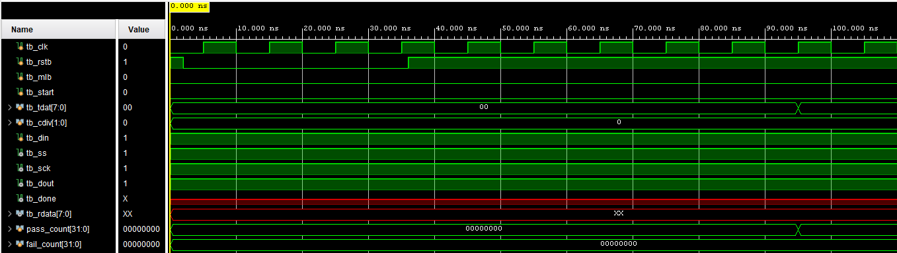
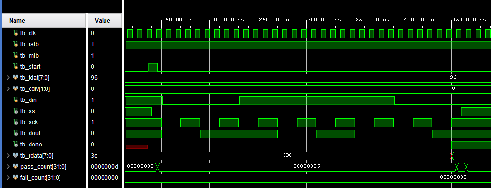
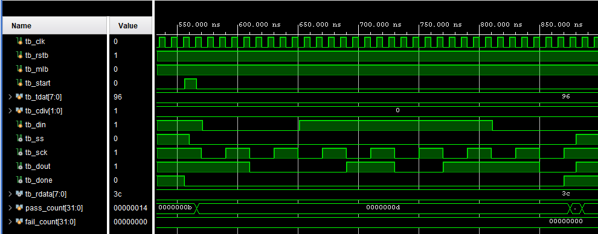
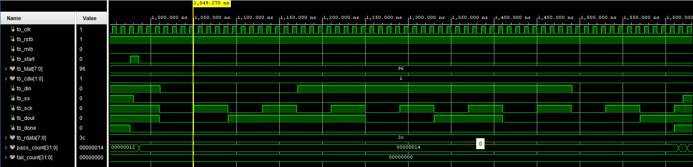

# SPI Master回路 評価報告書

## 評価対象
- 対象回路:
  - `spi_master.v`
- テストベンチ:
  - `tb_spi_master_20260623_183448.v`

## 評価目的
- SPI Master回路が、期待値表どおりに動作することを確認する。
- SPI mode 3での8bit送受信、ビット順の切替、`cdiv`によるSPIクロック分周を確認する。
- 通信中に`start`を入力した場合に、進行中の転送が維持され、完了後に第2転送が開始されないことを確認する。
- シミュレーションログから、以下の両方が判別できることを確認する。
  - 回路の入出力値
  - テストベンチの実行パスと各テストケースの合否

## 評価項目
- リセット後の待機状態確認
- LSB firstの基本送受信確認
- MSB firstの基本送受信確認
- `cdiv`によるSPIクロック分周確認
- 通信中`start`入力時の動作確認

## 合格条件
- `tb_spi_master_20260623_183448.v`内のチェックで`TB_FAIL`が0件であること
- 最終サマリに`fail=0`と表示されること
- 最終結果に`TB_RESULT: PASS`と表示されること
- `RESET`、`CASE1`、`CASE2`、`CASE3`、`CASE4`の各テストケースで`TB_PASS`が表示されること

## Vivadoでの実行手順
1. Vivadoプロジェクトを開く。
2. `spi_master.v`をDesign Sourcesに追加する。
3. `tb_spi_master_20260623_183448.v`をSimulation Sourcesに追加し、`tb_spi_master`をsimulation topに設定する。
4. Behavioral Simulationを実行する。
5. Consoleログを保存する。
6. 以下の信号を含む波形を保存する。
   - `tb_clk`
   - `tb_rstb`
   - `tb_mlb`
   - `tb_start`
   - `tb_tdat[7:0]`
   - `tb_cdiv[1:0]`
   - `tb_din`
   - `tb_ss`
   - `tb_sck`
   - `tb_dout`
   - `tb_done`
   - `tb_rdata[7:0]`
   - `pass_count[31:0]`
   - `fail_count[31:0]`

## シミュレーションログ
Vivado Behavioral Simulationを実行した結果、全35判定が合格した。主要なログを以下に示す。

```text
[95 ns]   TB_PASS: RESET ss must be 1 in idle
[95 ns]   TB_PASS: RESET sck must be 1 in SPI mode 3 idle
[95 ns]   TB_PASS: RESET dout must be 1 after clear

[455 ns]  TB_INFO: CASE1_LSB_BASIC expected_dout = 0,1,1,0,1,0,0,1
[455 ns]  TB_INFO: CASE1_LSB_BASIC captured_dout = 0,1,1,0,1,0,0,1
[455 ns]  TB_PASS: CASE1_LSB_BASIC rdata must match received din sequence
[455 ns]  TB_PASS: CASE1_LSB_BASIC sck period must match cdiv setting

[875 ns]  TB_INFO: CASE2_MSB_BASIC expected_dout = 1,0,0,1,0,1,1,0
[875 ns]  TB_INFO: CASE2_MSB_BASIC captured_dout = 1,0,0,1,0,1,1,0
[875 ns]  TB_PASS: CASE2_MSB_BASIC rdata must match received din sequence

[1130 ns] TB_INFO: CASE3_CDIV_01 measured_sck_period=80 ns
[1615 ns] TB_PASS: CASE3_CDIV_01 rdata must match received din sequence
[1615 ns] TB_PASS: CASE3_CDIV_01 sck period must match cdiv setting

[1776 ns] TB_CASE: mid_start pulse, tdat changed to 0xff
[2035 ns] TB_PASS: CASE4_MID_START rdata must match received din sequence
[2045 ns] TB_PASS: CASE4_MID_START mid-start must not change current transfer
[2446 ns] TB_INFO: CASE4_MID_START post_mid_start_second_transfer=0
[2446 ns] TB_PASS: CASE4_MID_START mid-start must not start a second transfer after completion

[2495 ns] TB_SUMMARY: pass=35 fail=0
[2495 ns] TB_RESULT: PASS
```

## 評価結果まとめ

### RESET リセット後の待機状態確認
| 項目 | 入力条件 | 期待値 | 実測値 | 判定 |
| --- | --- | --- | --- | --- |
| スレーブ選択信号 | リセット解除後 | `ss=1` | `ss=1` | 合格 |
| SPIクロック待機値 | リセット解除後 | `sck=1` | `sck=1` | 合格 |
| 送信線待機値 | リセット解除後 | `dout=1` | `dout=1` | 合格 |

### CASE1 LSB first基本送受信確認
| 項目 | 入力条件 | 期待値 | 実測値 | 判定 |
| --- | --- | --- | --- | --- |
| 送信順 | `mlb=0`、`tdat=8'h96` | `0,1,1,0,1,0,0,1` | `0,1,1,0,1,0,0,1` | 合格 |
| 受信データ | `din`列=`8'h3C` | `rdata=8'h3C` | `rdata=8'h3C` | 合格 |
| SPIクロック周期 | `cdiv=2'b00` | 40 ns | 40 ns | 合格 |
| 転送後の状態 | 8bit送受信完了後 | `ss=1`、`sck=1` | `ss=1`、`sck=1` | 合格 |

### CASE2 MSB first基本送受信確認
| 項目 | 入力条件 | 期待値 | 実測値 | 判定 |
| --- | --- | --- | --- | --- |
| 送信順 | `mlb=1`、`tdat=8'h96` | `1,0,0,1,0,1,1,0` | `1,0,0,1,0,1,1,0` | 合格 |
| 受信データ | `din`列=`8'h3C` | `rdata=8'h3C` | `rdata=8'h3C` | 合格 |
| 転送後の状態 | 8bit送受信完了後 | `ss=1`、`sck=1` | `ss=1`、`sck=1` | 合格 |

### CASE3 `cdiv`によるSPIクロック分周確認
| 項目 | 入力条件 | 期待値 | 実測値 | 判定 |
| --- | --- | --- | --- | --- |
| 分周設定 | `cdiv=2'b01` | `cdiv=2'b01` | `cdiv=2'b01` | 合格 |
| SPIクロック周期 | `cdiv=2'b01` | 80 ns | 80 ns | 合格 |
| 受信データ | `din`列=`8'h3C` | `rdata=8'h3C` | `rdata=8'h3C` | 合格 |
| 転送後の状態 | 8bit送受信完了後 | `ss=1`、`sck=1` | `ss=1`、`sck=1` | 合格 |

### CASE4 通信中`start`入力の確認
| 項目 | 入力条件 | 期待値 | 実測値 | 判定 |
| --- | --- | --- | --- | --- |
| 通信中の入力 | 通信中に`start=1`、`tdat=8'hFF` | 現在の転送を継続する | 1,776 nsで入力 | 合格 |
| 現在の送信列 | `tdat=8'h96`で開始 | `0,1,1,0,1,0,0,1`を維持 | `0,1,1,0,1,0,0,1` | 合格 |
| 受信データ | `din`列=`8'h3C` | `rdata=8'h3C` | `rdata=8'h3C` | 合格 |
| 第2転送の開始 | 完了後400 nsを監視 | 開始しない | `post_mid_start_second_transfer=0` | 合格 |

### 総括
| 項目 | 結果 |
| --- | --- |
| 総判定 | 合格 |
| 判定数 | `pass=35` |
| 不合格数 | `fail=0` |
| 結論 | SPI mode 3での送受信、ビット順切替、分周、および通信中`start`の無視が期待どおりに動作したことを確認した |

## 波形キャプチャ貼付欄

### 図1 RESET確認波形
- 対象ケース: RESET
- 推奨表示信号:
  - `tb_clk`
  - `tb_rstb`
  - `tb_mlb`
  - `tb_start`
  - `tb_tdat[7:0]`
  - `tb_cdiv[1:0]`
  - `tb_din`
  - `tb_ss`
  - `tb_sck`
  - `tb_dout`
  - `tb_done`
  - `tb_rdata[7:0]`
  - `pass_count[31:0]`
  - `fail_count[31:0]`
- 推奨表示時間帯: `0 ns` から `110 ns`
- 説明:
  - リセット解除後に`tb_ss=1`、`tb_sck=1`、`tb_dout=1`となることを確認した。



### 図2 LSB first基本送受信波形
- 対象ケース: CASE1
- 推奨表示信号:
  - `tb_clk`
  - `tb_rstb`
  - `tb_mlb`
  - `tb_start`
  - `tb_tdat[7:0]`
  - `tb_cdiv[1:0]`
  - `tb_din`
  - `tb_ss`
  - `tb_sck`
  - `tb_dout`
  - `tb_done`
  - `tb_rdata[7:0]`
  - `pass_count[31:0]`
  - `fail_count[31:0]`
- 推奨表示時間帯: `120 ns` から `470 ns`
- 説明:
  - `tb_mlb=0`、`tb_tdat=8'h96`で送信を開始し、`tb_dout`がLSB firstで出力されることを確認した。
  - 転送完了時に`tb_rdata=8'h3C`、`tb_done=1`となり、`tb_ss=1`、`tb_sck=1`の待機状態へ戻ることを確認した。



### 図3 MSB first基本送受信波形
- 対象ケース: CASE2
- 推奨表示信号:
  - `tb_clk`
  - `tb_rstb`
  - `tb_mlb`
  - `tb_start`
  - `tb_tdat[7:0]`
  - `tb_cdiv[1:0]`
  - `tb_din`
  - `tb_ss`
  - `tb_sck`
  - `tb_dout`
  - `tb_done`
  - `tb_rdata[7:0]`
  - `pass_count[31:0]`
  - `fail_count[31:0]`
- 推奨表示時間帯: `540 ns` から `890 ns`
- 説明:
  - `tb_mlb=1`、`tb_tdat=8'h96`で送信を開始し、`tb_dout`がMSB firstで出力されることを確認した。
  - 転送完了時に`tb_rdata=8'h3C`、`tb_done=1`となることを確認した。



### 図4 SPIクロック分周波形
- 対象ケース: CASE3
- 推奨表示信号:
  - `tb_clk`
  - `tb_rstb`
  - `tb_mlb`
  - `tb_start`
  - `tb_tdat[7:0]`
  - `tb_cdiv[1:0]`
  - `tb_din`
  - `tb_ss`
  - `tb_sck`
  - `tb_dout`
  - `tb_done`
  - `tb_rdata[7:0]`
  - `pass_count[31:0]`
  - `fail_count[31:0]`
- 推奨表示時間帯: `960 ns` から `1.63 us`
- 説明:
  - `tb_cdiv=2'b01`で送信を開始し、`tb_sck`の連続する立上り間隔が80 nsとなることを確認した。
  - 転送完了時に`tb_rdata=8'h3C`、`tb_done=1`となることを確認した。



### 図5 通信中`start`入力確認波形
- 対象ケース: CASE4
- 推奨表示信号:
  - `tb_clk`
  - `tb_rstb`
  - `tb_mlb`
  - `tb_start`
  - `tb_tdat[7:0]`
  - `tb_cdiv[1:0]`
  - `tb_din`
  - `tb_ss`
  - `tb_sck`
  - `tb_dout`
  - `tb_done`
  - `tb_rdata[7:0]`
  - `pass_count[31:0]`
  - `fail_count[31:0]`
- 推奨表示時間帯: `1.70 us` から `2.46 us`
- 説明:
  - 通信中に`tb_start=1`および`tb_tdat=8'hFF`を入力しても、送信中の`8'h96`のビット列が変化しないことを確認した。
  - 転送完了後に`tb_ss=1`が維持され、400 nsの監視期間に第2転送が開始されないことを確認した。


