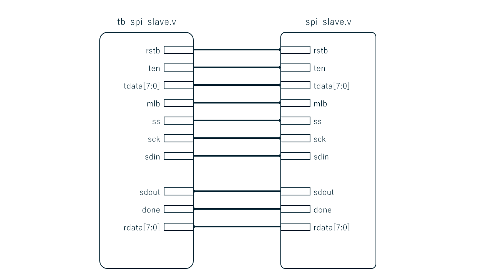
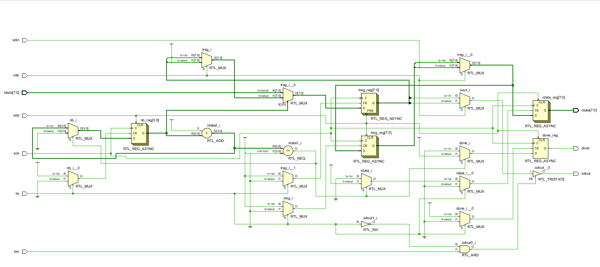

# SPI Slave回路およびテストベンチ説明書

## 対象ファイル

- `spi_slave.v`: SPI Slave回路
- `tb_spi_slave.v`: 検証用テストベンチ

## 回路概要

本回路は、OpenCoresのSPI Slave回路である。選択信号`ss`がLowの間、SPIクロック`sck`に同期して、マスタから`sdin`へ入力される8 bitデータを受信し、受信結果を`rdata`へ出力する。同時に、送信データ`tdata`を`sdout`から1 bitずつ出力する。

`ss`はactive lowのスレーブ選択信号であり、`ss=1`のときスレーブは非選択状態となる。非選択状態では`sdout`はハイインピーダンス（`Z`）となり、`sck`が変化しても受信状態は更新されない。`ten`は送信出力イネーブルであり、`ss=0`かつ`ten=1`のときだけ`sdout`がデータを駆動する。`ten=0`では`sdout=Z`となるが、受信処理は継続する。

## 実装する通信仕様の概要

本回路はSPI mode 3で動作する。アイドル時の`sck`はHighであり、送信データは`sck`の立下りで更新され、受信データは`sck`の立上りで取り込まれる。

| 一般的なSPI信号 | 本回路での信号名 | 方向・役割 |
| --- | --- | --- |
| SCK | `sck` | マスタから入力されるSPIクロック |
| MOSI | `sdin` | マスタからスレーブへ入力されるシリアルデータ |
| MISO | `sdout` | スレーブからマスタへ出力されるシリアルデータ |
| SS / CS | `ss` | active lowのスレーブ選択信号 |

`mlb`によってビット転送順を選択する。

| `mlb` | ビット転送順 |
| --- | --- |
| `0` | LSB first |
| `1` | MSB first |

送受信するデータ幅は8 bitである。8回目の`sck`立上りで受信データを`rdata`へ確定し、`done`を`1`にする。

## 構成図（ブロック図）

PowerPoint編集用ファイル: [spi_slave.pptx](./images/spi_slave.pptx)

## 回路図

## `spi_slave.v`

### 入力信号

- `rstb`: active lowの非同期リセット信号
- `ten`: `sdout`の出力イネーブル信号
- `tdata[7:0]`: スレーブから送信する8 bitデータ
- `mlb`: ビット転送順を選択する信号
- `ss`: active lowのスレーブ選択信号
- `sck`: SPIクロック
- `sdin`: マスタから入力されるシリアルデータ

### 出力信号

- `sdout`: マスタへ出力するシリアルデータ。`ss=0`かつ`ten=1`のときだけ有効となる
- `done`: 8 bit受信の完了を示す信号
- `rdata[7:0]`: 受信した8 bitデータ

### 内部レジスタ

- `treg[7:0]`: `tdata`を保持し、`sdout`へ1 bitずつ出力する送信レジスタ
- `rreg[7:0]`: `sdin`から取り込んだデータを一時保持する受信レジスタ
- `nb[3:0]`: 受信済みビット数を数えるビットカウンタ
- `sout`: `mlb`に応じて`treg[0]`または`treg[7]`を選択する内部信号

### 機能

- `rstb=0`では、`rreg`、`rdata`、`done`および`nb`を初期化する。`treg`は`8'hFF`に初期化する
- `ss=0`の間、`sck`の立上りごとに`sdin`を受信レジスタへ取り込む
- `mlb=0`ではLSB firstとして右シフト方向で受信し、`mlb=1`ではMSB firstとして左シフト方向で受信する
- 8 bitの受信完了時に`rdata`へ`rreg`を転送し、`done=1`とする
- `sck`の立下りで、最初のビットでは`tdata`を`treg`へロードし、それ以降は`mlb`に応じた方向へ`treg`をシフトする
- `ss=0`かつ`ten=1`のとき、`sdout`は`treg`の送信対象ビットを出力する
- `ss=1`または`ten=0`のとき、`sdout`は`Z`となる

### 主要ステータス信号とテスト内容

#### `sdout`の状態遷移と確認方針

- `sdout`は`ss=0`かつ`ten=1`のときだけ有効である
- `CASE1_LSB_BASIC`では、`tdata=8'h96`をLSB firstで出力する順序を確認する
- `CASE2_MSB_BASIC`では、`tdata=8'h96`をMSB firstで出力する順序を確認する
- `CASE3_TEN_DISABLED`では、`ten=0`により転送中も`sdout=Z`となることを確認する
- `CASE4_SS_INACTIVE`では、`ss=1`により`sck`が変化しても`sdout=Z`となることを確認する

#### `done`と`rdata`の状態遷移と確認方針

- リセット直後は`done=0`、`rdata=8'h00`であることを確認する
- `CASE1_LSB_BASIC`および`CASE2_MSB_BASIC`では、`sdin`から入力した`8'h53`が`rdata`へ格納され、8 bit受信後に`done=1`となることを確認する
- `CASE3_TEN_DISABLED`では、送信出力を無効にしても`sdin`から入力した`8'h3A`を受信でき、`done=1`となることを確認する
- `CASE4_SS_INACTIVE`では、`ss=1`の間は`rdata=8'h00`および`done=0`を維持することを確認する

## `tb_spi_slave.v`

### 目的

- `spi_slave.v`のリセット動作、送信順序、受信動作、および出力のトライステート制御を検証する
- LSB firstとMSB firstの両方で、送信ビット列と受信データが正しいことを確認する
- `ten=0`および`ss=1`のときに、`sdout`が他の回路を駆動しないことを確認する
- テストベンチのログにテスト経路、各ケース、内部状態、判定結果を出力する

### テストケース

- `RESET`: リセット後の`done`、`rdata`、`sdout`を確認する
- `CASE1_LSB_BASIC`: `mlb=0`、`ten=1`で、LSB firstの送受信を確認する
- `CASE2_MSB_BASIC`: `mlb=1`、`ten=1`で、MSB firstの送受信を確認する
- `CASE3_TEN_DISABLED`: `mlb=0`、`ten=0`で、`sdout=Z`を維持しながら受信することを確認する
- `CASE4_SS_INACTIVE`: `ss=1`のまま8回の`sck`を与え、出力および受信状態が変化しないことを確認する

### Vivado Wave で観測すべき主な信号

- `tb_rstb`
- `tb_ten`
- `tb_tdata[7:0]`
- `tb_mlb`
- `tb_ss`
- `tb_sck`
- `tb_sdin`
- `tb_sdout`
- `tb_done`
- `tb_rdata[7:0]`
- `pass_count[31:0]`
- `fail_count[31:0]`
