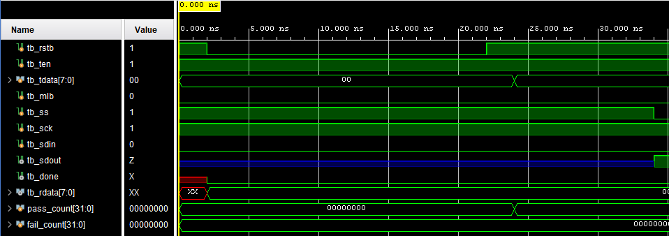
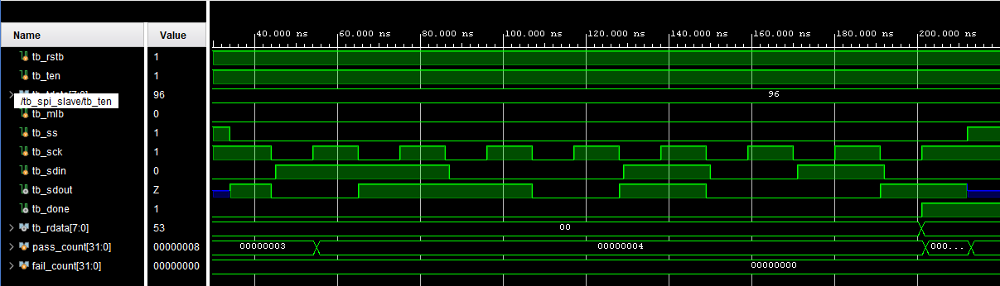
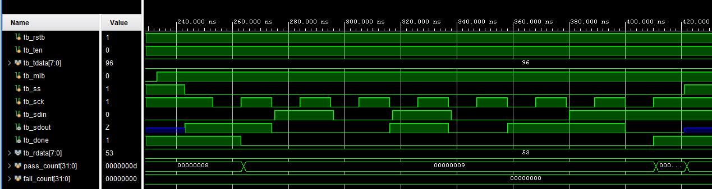
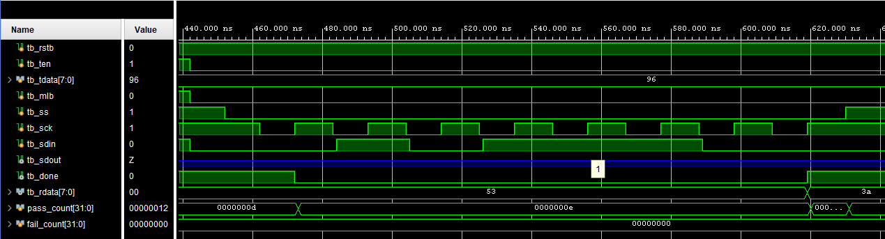
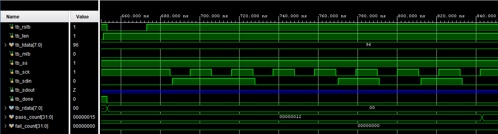

# SPI Slave回路 評価報告書

## 評価対象

- 対象回路: `spi_slave.v`
- テストベンチ: `tb_spi_slave.v`

## 評価目的

- SPI mode 3における8 bitの送信および受信が正しく動作することを確認する
- `mlb`によるLSB firstとMSB firstのビット順切替が正しく動作することを確認する
- `ten`および`ss`による`sdout`のトライステート制御が正しく動作することを確認する
- 非選択状態でスレーブ内部の受信状態が更新されないことを確認する

## 評価項目

| 項目 | 確認内容 |
| --- | --- |
| リセット | `done=0`、`rdata=8'h00`、`sdout=Z`となること |
| LSB first送信 | `tdata=8'h96`が`0,1,1,0,1,0,0,1`の順に出力されること |
| MSB first送信 | `tdata=8'h96`が`1,0,0,1,0,1,1,0`の順に出力されること |
| 受信 | `sdin`から入力した8 bitデータが`rdata`へ格納されること |
| 送信無効 | `ten=0`で`sdout=Z`を維持しつつ受信できること |
| 非選択 | `ss=1`で`sdout=Z`、`rdata`および`done`を維持すること |

## 合格条件

- `TB_FAIL`が出力されないこと
- `TB_SUMMARY: pass=21 fail=0`が出力されること
- `TB_RESULT: PASS`が出力されること
- CASE1およびCASE2で、`sdout`のビット列が設定したビット順と一致すること
- CASE1からCASE3で、受信完了後の`rdata`が入力したシリアルデータと一致すること
- CASE3およびCASE4で、`sdout`が`Z`であること
- CASE4で、`rdata=8'h00`および`done=0`を維持すること

## Vivadoでの実行手順

1. Vivadoプロジェクトへ`spi_slave.v`をDesign Sourcesとして追加する。
2. `tb_spi_slave.v`をSimulation Sourcesとして追加する。
3. Simulation Topを`tb_spi_slave`に設定する。
4. `Run Behavioral Simulation`を実行する。
5. Consoleで`TB_SUMMARY`および`TB_RESULT`を確認する。
6. Waveウィンドウへ、以下の信号を個別に追加する。

- `tb_rstb`
- `tb_ten`
- `tb_tdata[7:0]`
- `tb_mlb`
- `tb_ss`
- `tb_sck`
- `tb_sdin`
- `tb_sdout`
- `tb_done`
- `tb_rdata[7:0]`
- `pass_count[31:0]`
- `fail_count[31:0]`

## シミュレーションログ

Vivado Behavioral Simulationを実行した結果、全21判定が合格した。主要なログを以下に示す。

```text
[24 ns]  TB_DUT_PATH: after reset nb=0 done=0 rdata=0x00 sdout=z
[24 ns]  TB_PASS: RESET done must be 0
[24 ns]  TB_PASS: RESET rdata must be 0x00
[24 ns]  TB_PASS: RESET sdout must be Z while ss is 1

[202 ns] TB_INFO: CASE1_LSB_BASIC expected_sdout = 0,1,1,0,1,0,0,1
[202 ns] TB_INFO: CASE1_LSB_BASIC captured_sdout = 0,1,1,0,1,0,0,1
[202 ns] TB_DUT_PATH: CASE1_LSB_BASIC transfer complete nb=0 done=1 rdata=0x53

[411 ns] TB_INFO: CASE2_MSB_BASIC expected_sdout = 1,0,0,1,0,1,1,0
[411 ns] TB_INFO: CASE2_MSB_BASIC captured_sdout = 1,0,0,1,0,1,1,0
[411 ns] TB_DUT_PATH: CASE2_MSB_BASIC transfer complete nb=0 done=1 rdata=0x53

[620 ns] TB_PASS: CASE3_TEN_DISABLED sdout must remain Z while ten is 0
[620 ns] TB_DUT_PATH: CASE3_TEN_DISABLED transfer complete nb=0 done=1 rdata=0x3a

[843 ns] TB_DUT_PATH: CASE4_SS_INACTIVE complete nb=0 done=0 rdata=0x00
[863 ns] TB_SUMMARY: pass=21 fail=0
[863 ns] TB_RESULT: PASS
```

## 評価結果まとめ

### RESET リセット後の状態確認

| 項目 | 入力条件 | 期待値 | 実測値 | 判定 |
| --- | --- | --- | --- | --- |
| 受信完了信号 | リセット解除直後 | `done=0` | `done=0` | 合格 |
| 受信データ | リセット解除直後 | `rdata=8'h00` | `rdata=8'h00` | 合格 |
| 送信線 | `ss=1` | `sdout=Z` | `sdout=z` | 合格 |

### CASE1_LSB_BASIC LSB first送受信確認

| 項目 | 入力条件 | 期待値 | 実測値 | 判定 |
| --- | --- | --- | --- | --- |
| 送信ビット列 | `mlb=0`、`tdata=8'h96` | `0,1,1,0,1,0,0,1` | `0,1,1,0,1,0,0,1` | 合格 |
| 受信途中の完了信号 | 1 bit受信後 | `done=0` | `done=0` | 合格 |
| 受信データ | `sdin`へ`8'h53`をLSB firstで入力 | `rdata=8'h53` | `rdata=8'h53` | 合格 |
| 受信完了信号 | 8 bit受信後 | `done=1` | `done=1` | 合格 |
| 非選択後の送信線 | `ss=1` | `sdout=Z` | `sdout=z` | 合格 |

### CASE2_MSB_BASIC MSB first送受信確認

| 項目 | 入力条件 | 期待値 | 実測値 | 判定 |
| --- | --- | --- | --- | --- |
| 送信ビット列 | `mlb=1`、`tdata=8'h96` | `1,0,0,1,0,1,1,0` | `1,0,0,1,0,1,1,0` | 合格 |
| 受信途中の完了信号 | 1 bit受信後 | `done=0` | `done=0` | 合格 |
| 受信データ | `sdin`へ`8'h53`をMSB firstで入力 | `rdata=8'h53` | `rdata=8'h53` | 合格 |
| 受信完了信号 | 8 bit受信後 | `done=1` | `done=1` | 合格 |
| 非選択後の送信線 | `ss=1` | `sdout=Z` | `sdout=z` | 合格 |

### CASE3_TEN_DISABLED 送信無効時の受信確認

| 項目 | 入力条件 | 期待値 | 実測値 | 判定 |
| --- | --- | --- | --- | --- |
| 送信線 | `ss=0`、`ten=0` | `sdout=Z`を維持 | `sdout=z`を維持 | 合格 |
| 受信途中の完了信号 | 1 bit受信後 | `done=0` | `done=0` | 合格 |
| 受信データ | `sdin`へ`8'h3A`をLSB firstで入力 | `rdata=8'h3A` | `rdata=8'h3A` | 合格 |
| 受信完了信号 | 8 bit受信後 | `done=1` | `done=1` | 合格 |

### CASE4_SS_INACTIVE 非選択時の状態維持確認

| 項目 | 入力条件 | 期待値 | 実測値 | 判定 |
| --- | --- | --- | --- | --- |
| 送信線 | `ss=1`で8回の`sck`変化 | `sdout=Z`を維持 | `sdout=z`を維持 | 合格 |
| 受信データ | `ss=1`で`sdin`を変化 | `rdata=8'h00`を維持 | `rdata=8'h00`を維持 | 合格 |
| 受信完了信号 | `ss=1`で8回の`sck`変化 | `done=0`を維持 | `done=0`を維持 | 合格 |

### 総括

RESET、LSB first、MSB first、送信無効および非選択の全テストケースで期待値と実測値が一致した。特に、`ten=0`では受信を継続しながら`sdout`をトライステートにできること、`ss=1`では`sdout`、`rdata`および`done`が変化しないことを確認できた。最終結果は`TB_SUMMARY: pass=21 fail=0`および`TB_RESULT: PASS`であり、本テストベンチの評価範囲において回路は正常に動作した。

## 波形キャプチャ貼付欄

### 図1 RESET確認波形



- 対象ケース: `RESET`
- 推奨表示信号
  - `tb_rstb`
  - `tb_ss`
  - `tb_sck`
  - `tb_ten`
  - `tb_sdout`
  - `tb_done`
  - `tb_rdata[7:0]`
  - `pass_count[31:0]`
  - `fail_count[31:0]`
- 推奨表示時間帯: `0 ns`から`35 ns`
- 説明: `tb_rstb`をLowにした後、`done=0`、`rdata=8'h00`へ初期化されることを確認する。`ss=1`のため、`sdout`は`Z`である。

### 図2 LSB first送受信確認波形



- 対象ケース: `CASE1_LSB_BASIC`
- 推奨表示信号
  - `tb_rstb`
  - `tb_ten`
  - `tb_tdata[7:0]`
  - `tb_mlb`
  - `tb_ss`
  - `tb_sck`
  - `tb_sdin`
  - `tb_sdout`
  - `tb_done`
  - `tb_rdata[7:0]`
  - `pass_count[31:0]`
  - `fail_count[31:0]`
- 推奨表示時間帯: `30 ns`から`220 ns`
- 説明: `mlb=0`および`ten=1`でスレーブを選択し、`sdout`が`8'h96`のLSB first順序で出力されることを確認する。`sdin`からLSB firstで入力した`8'h53`が`rdata`へ格納され、8 bit目の受信後に`done=1`となる。

### 図3 MSB first送受信確認波形



- 対象ケース: `CASE2_MSB_BASIC`
- 推奨表示信号
  - `tb_rstb`
  - `tb_ten`
  - `tb_tdata[7:0]`
  - `tb_mlb`
  - `tb_ss`
  - `tb_sck`
  - `tb_sdin`
  - `tb_sdout`
  - `tb_done`
  - `tb_rdata[7:0]`
  - `pass_count[31:0]`
  - `fail_count[31:0]`
- 推奨表示時間帯: `235 ns`から`430 ns`
- 説明: `mlb=1`および`ten=1`で、`sdout`が`8'h96`のMSB first順序で出力されることを確認する。`sdin`からMSB firstで入力した`8'h53`が`rdata`へ格納されることを確認する。

### 図4 送信無効時の受信確認波形



- 対象ケース: `CASE3_TEN_DISABLED`
- 推奨表示信号
  - `tb_rstb`
  - `tb_ten`
  - `tb_tdata[7:0]`
  - `tb_mlb`
  - `tb_ss`
  - `tb_sck`
  - `tb_sdin`
  - `tb_sdout`
  - `tb_done`
  - `tb_rdata[7:0]`
  - `pass_count[31:0]`
  - `fail_count[31:0]`
- 推奨表示時間帯: `445 ns`から`640 ns`
- 説明: `ten=0`のため、`ss=0`でクロックを与えても`sdout=Z`を維持することを確認する。一方で、LSB firstで入力した`8'h3A`が`rdata`へ格納され、`done=1`となることを確認する。

### 図5 非選択時の状態維持確認波形



- 対象ケース: `CASE4_SS_INACTIVE`
- 推奨表示信号
  - `tb_rstb`
  - `tb_ten`
  - `tb_tdata[7:0]`
  - `tb_mlb`
  - `tb_ss`
  - `tb_sck`
  - `tb_sdin`
  - `tb_sdout`
  - `tb_done`
  - `tb_rdata[7:0]`
  - `pass_count[31:0]`
  - `fail_count[31:0]`
- 推奨表示時間帯: `650 ns`から`850 ns`
- 説明: `ss=1`の非選択状態で8回の`sck`を与える。`sdout=Z`を維持し、`sdin`が変化しても`rdata=8'h00`および`done=0`が変化しないことを確認する。
