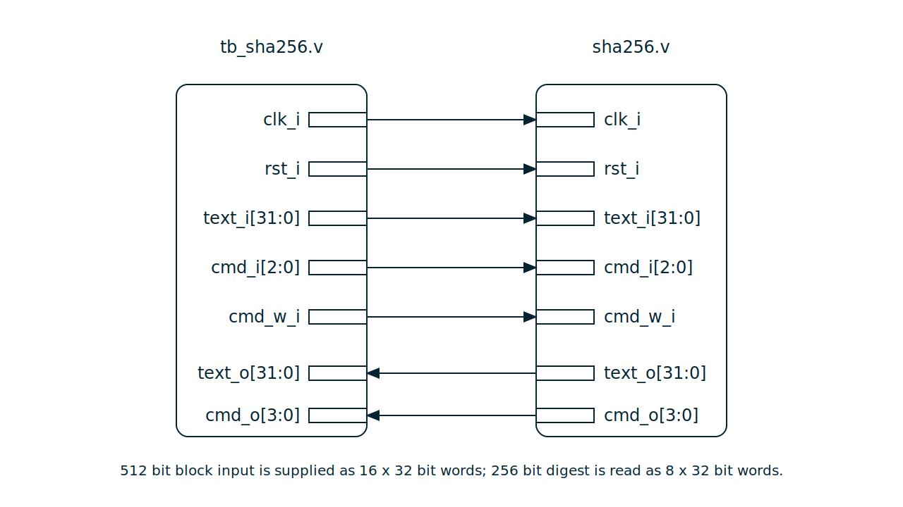
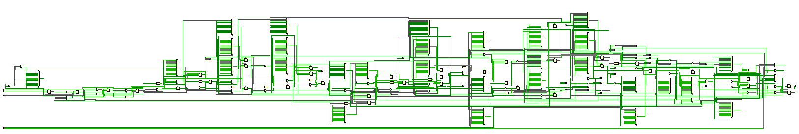

# SHA-256簡易ハッシュ回路およびテストベンチ説明書

## 対象ファイル

- `sha256.v`: SHA-256ハッシュ計算回路
- `tb_sha256.v`: 検証用テストベンチ

## 回路概要

本回路は、OpenCoresのSHA-256計算回路である。SHA-256は任意長の入力データから256 bitのハッシュ値を生成するハッシュ関数である。ただし、本RTLは文字列やバイト列を直接受け取り、paddingまで自動で行う上位ラッパではなく、SHA-256の512 bitブロックを32 bit単位で受け取り、圧縮計算を行う計算コアである。

そのため、検証ではテストベンチ側で入力メッセージをSHA-256の仕様に従って512 bitブロックへ整形し、`text_i[31:0]`へ16 word分順番に入力する。計算完了後は、`text_o[31:0]`から256 bitのハッシュ値を32 bitずつ8回読み出し、既知のSHA-256期待値と比較する。

今回のテストでは、基本動作を確認する入力として文字列`abc`、特殊な入力として空入力、複数ブロック処理の確認としてOpenCores付属テストベンチで用いられている長い文字列を使用する。

## 実装する処理仕様の概要

SHA-256では、入力メッセージを512 bit単位のブロックに分割して処理する。512 bitブロックは32 bit wordで見ると16個であり、本回路ではこの16 wordを`text_i`へ1 clockごとに入力する。

入力メッセージは、そのままブロック化されるのではなく、SHA-256のpadding規則に従って整形される。paddingでは、メッセージ末尾に`1`を付加し、その後に`0`を詰め、最後の64 bitに元メッセージ長をbit数で格納する。

例として、文字列`abc`は3 byte、すなわち24 bitであるため、1ブロック入力は次のようになる。

```text
W0  = 32'h61626380
W1  = 32'h00000000
...
W14 = 32'h00000000
W15 = 32'h00000018
```

`32'h61626380`のうち、`61 62 63`はASCIIコードの`a b c`を表し、`80`はpadding開始を表す。最後の`32'h00000018`は、元メッセージ長が24 bitであることを表す。

本回路はコマンド入力`cmd_i`とコマンド書き込み信号`cmd_w_i`によって制御される。主なコマンドは以下の通りである。

| コマンド | 意味 |
| --- | --- |
| `cmd_i=3'b010` | 1ブロック目の書き込み開始 |
| `cmd_i=3'b110` | 2ブロック目以降の書き込み開始 |
| `cmd_i=3'b001` | 計算結果の読み出し開始 |

`cmd_i=3'b010`では、SHA-256の初期ハッシュ値から計算を開始する。`cmd_i=3'b110`では、前ブロックの計算結果を引き継いで次ブロックを処理する。したがって、1ブロックだけの入力では`3'b010`のみを用い、複数ブロック入力では1ブロック目に`3'b010`、2ブロック目以降に`3'b110`を用いる。

`cmd_o[3:0]`は回路状態を表すステータス信号であり、各bitの意味は以下の通りである。

| bit | 名称 | 意味 |
| --- | --- | --- |
| `cmd_o[3]` | Busy | 計算中であることを示す |
| `cmd_o[2]` | Round | 0で初回ブロック、1で継続ブロックを示す |
| `cmd_o[1]` | W | 書き込みコマンドが保持されていることを示す |
| `cmd_o[0]` | R | 読み出しコマンドが保持されていることを示す |

## 構成図（ブロック図）



PowerPoint編集用ファイル: [sha256.pptx](./images/sha256.pptx)

## 回路図



## `sha256.v`

### 入力信号

- `clk_i`: システムクロック
- `rst_i`: active highのリセット信号
- `text_i[31:0]`: SHA-256入力ブロックの32 bit word
- `cmd_i[2:0]`: 書き込み開始、継続ブロック、読み出しを指定するコマンド入力
- `cmd_w_i`: `cmd_i`を回路内部のコマンドレジスタへ書き込むためのenable信号

### 出力信号

- `text_o[31:0]`: 計算結果のSHA-256 digestを32 bitずつ出力する信号
- `cmd_o[3:0]`: busy状態、round mode、write/read commandの状態を示すステータス信号

### 内部レジスタ

- `cmd[3:0]`: コマンドおよびステータスを保持するレジスタ
- `round[6:0]`: SHA-256の計算ラウンドを管理するカウンタ
- `read_counter[2:0]`: 256 bit digestを8個の32 bit wordとして読み出すためのカウンタ
- `H0`から`H7`: 各ブロック処理で用いる中間ハッシュ値
- `A`から`H`: SHA-256の圧縮計算で使用する作業レジスタ
- `W0`から`W14`、`Wt`: メッセージスケジュールを保持するレジスタ
- `Kt`: 各roundで使用するSHA-256定数
- `busy`: 計算中であることを示す内部状態信号

### 機能

- `rst_i=1`で、コマンド、出力、roundカウンタ、内部レジスタを初期化する。
- `cmd_w_i=1`のとき、`cmd_i[2:0]`を内部の`cmd[2:0]`へ取り込む。ただし、busy bitである`cmd[3]`は外部から直接書き込まず、内部の`busy`に基づいて更新される。
- `cmd[1]=1`のとき、`text_i`に入力されている先頭wordを`W0`として取り込み、SHA-256計算を開始する。
- `cmd[2]=0`の場合はSHA-256の初期値から計算を開始し、`cmd[2]=1`の場合は前ブロックの計算結果を引き継いで計算する。
- 入力ブロックの残り15 wordは、計算開始後の各clockで`text_i`から順番に取り込まれる。
- 内部では64 round分の圧縮計算を行い、最終roundで中間ハッシュ値を更新して`busy=0`へ戻る。
- `cmd[0]=1`の読み出しコマンドを受けると、`read_counter`を7に設定し、`busy=0`の間に`text_o`へ上位wordから順番にdigestを出力する。

### 主要ステータス信号とテスト内容

#### `cmd_o[3]`によるbusy状態の確認

- 書き込み開始後に`cmd_o[3]=1`となり、計算中であることを確認する。
- 計算完了後に`cmd_o[3]=0`へ戻ることを確認する。
- この確認は、基本動作確認である`CASE1_SHA256_ABC_SINGLE_BLOCK`および各ブロック処理の中に含める。

#### `text_o[31:0]`によるdigest読み出し確認

- 読み出しコマンド`cmd_i=3'b001`の後、`text_o`から32 bit wordが8回出力されることを確認する。
- 読み出し順序は、SHA-256 digestの上位32 bitから下位32 bitの順である。
- 各wordを期待値と比較し、最後に256 bit全体のdigestが一致することを確認する。

#### 複数ブロック処理の確認

- 1ブロック目では`cmd_i=3'b010`を用い、SHA-256初期値から計算する。
- 2ブロック目では`cmd_i=3'b110`を用い、1ブロック目の計算結果を引き継いで計算する。
- 複数ブロック入力の最終digestが既知値と一致することで、内部状態の引き継ぎが正しいことを確認する。

## `tb_sha256.v`

### 目的

- `sha256.v`に対して、リセット、1ブロック入力、特殊入力、複数ブロック入力を与え、主要機能が期待通りに動作することを確認する。
- 入力メッセージをSHA-256の512 bitブロックへ変換した状態で与え、回路のブロック処理およびdigest読み出しを検証する。
- テスト実行経路、入力word、内部状態、判定結果をシミュレーションログとして出力する。

### テストケース

- `RESET`: リセット中に`cmd_o=4'b0000`、`text_o=32'h00000000`、内部`busy=0`であることを確認する。
- `CASE1_SHA256_ABC_SINGLE_BLOCK`: 文字列`abc`を1ブロックのSHA-256入力として処理し、既知のdigestと一致することを確認する。
- `CASE2_SHA256_EMPTY_SINGLE_BLOCK`: 空入力をpaddingのみの1ブロックとして処理し、既知のdigestと一致することを確認する。
- `CASE3_SHA256_MULTI_BLOCK`: OpenCores付属テストベンチで用いられている長い文字列を2ブロックで処理し、継続ブロック処理が正しいことを確認する。

### Vivado Wave で観測すべき主な信号

- `tb_clk_i`
- `tb_rst_i`
- `tb_text_i[31:0]`
- `tb_text_o[31:0]`
- `tb_cmd_i[2:0]`
- `tb_cmd_w_i`
- `tb_cmd_o[3:0]`
- `dut.busy`
- `dut.round[6:0]`
- `dut.read_counter[2:0]`
- `pass_count[31:0]`
- `fail_count[31:0]`
