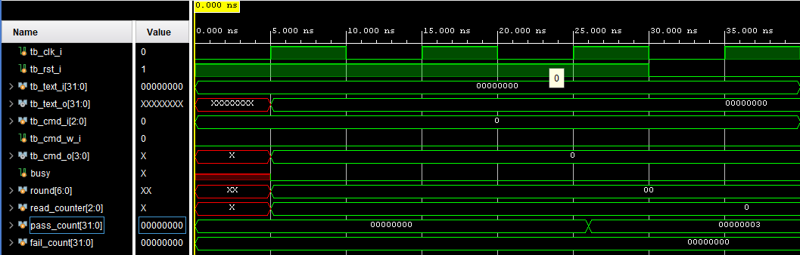
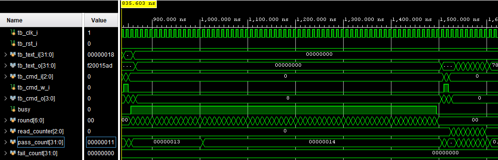
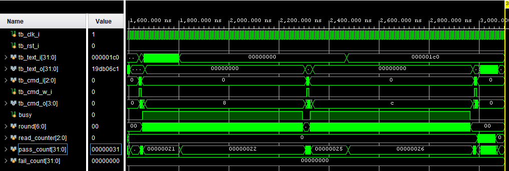

# SHA-256簡易ハッシュ回路 評価報告書

## 評価対象

- 対象回路: `sha256.v`
- テストベンチ: `tb_sha256.v`

## 評価目的

- SHA-256計算回路が、padding済み512 bitブロックを32 bit word単位で受け取り、既知のSHA-256ハッシュ値を出力できることを確認する。
- 1ブロック入力、空入力、複数ブロック入力を用いて、基本動作と特殊入力、および内部状態の引き継ぎ動作を確認する。
- `cmd_i`、`cmd_w_i`、`cmd_o`による制御インターフェースが期待通りに動作することを確認する。
- ハッシュ値読み出し時に、`text_o`から上位32 bit wordから下位32 bit wordの順に出力されることを確認する。

## 評価項目

| 項目 | 確認内容 |
| --- | --- |
| リセット | `cmd_o=4'b0000`、`text_o=32'h00000000`、内部`busy=0`となること |
| 1ブロック基本動作 | 文字列`abc`のSHA-256ハッシュ値が既知値と一致すること |
| 空入力 | 空入力のSHA-256ハッシュ値が既知値と一致すること |
| 複数ブロック処理 | 2ブロック入力で前ブロックの計算結果を引き継ぎ、最終ハッシュ値が既知値と一致すること |
| busy状態 | 書き込み開始後にbusyが立ち、計算完了後にbusyが下がること |
| ハッシュ値読み出し | 読み出しコマンド後に8個の32 bit wordが期待順序で出力されること |

## 合格条件

- `TB_FAIL`が出力されないこと
- `TB_SUMMARY: pass=49 fail=0`が出力されること
- `TB_RESULT: PASS`が出力されること
- RESET、CASE1、CASE2、CASE3のすべてで期待値と実測値が一致すること
- CASE3において、1ブロック目を`cmd_i=3'b010`、2ブロック目を`cmd_i=3'b110`で処理し、複数ブロック入力のハッシュ値が期待値と一致すること

## Vivadoでの実行手順

1. Vivadoプロジェクトへ`sha256.v`をDesign Sourcesとして追加する。
2. `tb_sha256.v`をSimulation Sourcesとして追加する。
3. Simulation Topを`tb_sha256`に設定する。
4. `Run Behavioral Simulation`を実行する。
5. Consoleで`TB_SUMMARY`および`TB_RESULT`を確認する。
6. Waveウィンドウへ以下の信号を追加し、各ケースの波形を保存する。

- `tb_clk_i`
- `tb_rst_i`
- `tb_text_i[31:0]`
- `tb_text_o[31:0]`
- `tb_cmd_i[2:0]`
- `tb_cmd_w_i`
- `tb_cmd_o[3:0]`
- `dut.busy`
- `dut.round[6:0]`
- `dut.read_counter[2:0]`
- `pass_count[31:0]`
- `fail_count[31:0]`

## シミュレーションログ

Vivado Behavioral Simulationを実行した結果、全ケースで期待値と実測値が一致した。主要ログを以下に示す。

```text
[26 ns] TB_DUT_PATH: during reset cmd_o=0b0000 text_o=0x00000000 busy=0 round=0
[26 ns] TB_PASS: RESET cmd_o must be 0
[26 ns] TB_PASS: RESET text_o must be 0x00000000
[26 ns] TB_PASS: RESET internal busy must be 0

[706 ns] TB_DUT_PATH: CASE1 calculation complete cmd_o=0b0000 busy=0 round=0
[736 ns] TB_INFO: CASE1 digest_word0 expected=0xba7816bf actual=0xba7816bf read_counter=6
[806 ns] TB_INFO: CASE1 digest_word7 expected=0xf20015ad actual=0xf20015ad read_counter=0
[806 ns] TB_PASS: CASE1 full digest must match expected

[1506 ns] TB_DUT_PATH: CASE2 calculation complete cmd_o=0b0000 busy=0 round=0
[1536 ns] TB_INFO: CASE2 digest_word0 expected=0xe3b0c442 actual=0xe3b0c442 read_counter=6
[1606 ns] TB_INFO: CASE2 digest_word7 expected=0x7852b855 actual=0x7852b855 read_counter=0
[1606 ns] TB_PASS: CASE2 full digest must match expected

[2306 ns] TB_DUT_PATH: CASE3 block0 calculation complete cmd_o=0b0000 busy=0 round=0
[2976 ns] TB_DUT_PATH: CASE3 block1 calculation complete cmd_o=0b0100 busy=0 round=0
[3006 ns] TB_INFO: CASE3 digest_word0 expected=0x248d6a61 actual=0x248d6a61 read_counter=6
[3076 ns] TB_INFO: CASE3 digest_word7 expected=0x19db06c1 actual=0x19db06c1 read_counter=0
[3076 ns] TB_PASS: CASE3 full digest must match expected

[3105 ns] TB_SUMMARY: pass=49 fail=0
[3105 ns] TB_RESULT: PASS
```

## 評価結果まとめ

### RESET リセット状態確認

| 項目 | 入力条件 | 期待値 | 実測値 | 判定 |
| --- | --- | --- | --- | --- |
| コマンド状態 | `rst_i=1` | `cmd_o=4'b0000` | `cmd_o=4'b0000` | 合格 |
| 出力データ | `rst_i=1` | `text_o=32'h00000000` | `text_o=32'h00000000` | 合格 |
| 内部busy | `rst_i=1` | `busy=0` | `busy=0` | 合格 |

### CASE1 基本動作確認

| 項目 | 入力条件 | 期待値 | 実測値 | 判定 |
| --- | --- | --- | --- | --- |
| 入力ブロック | `abc`をpaddingした1ブロック | W0=`32'h61626380`、W15=`32'h00000018` | W0=`32'h61626380`、W15=`32'h00000018` | 合格 |
| busy遷移 | 書き込み開始後 | `busy=1`、計算完了後`cmd_o[3]=0` | `busy=1`、完了時`cmd_o=4'b0000` | 合格 |
| ハッシュ値のword | 読み出しコマンド後 | `ba7816bf 8f01cfea 414140de 5dae2223 b00361a3 96177a9c b410ff61 f20015ad` | `ba7816bf 8f01cfea 414140de 5dae2223 b00361a3 96177a9c b410ff61 f20015ad` | 合格 |
| 256 bitハッシュ値全体 | 8 word読み出し後 | 期待されるハッシュ値と一致 | 期待されるハッシュ値と一致 | 合格 |

### CASE2 空入力確認

| 項目 | 入力条件 | 期待値 | 実測値 | 判定 |
| --- | --- | --- | --- | --- |
| 入力ブロック | 空入力をpaddingした1ブロック | W0=`32'h80000000`、W1からW15=`32'h00000000` | W0=`32'h80000000`、W1からW15=`32'h00000000` | 合格 |
| busy遷移 | 書き込み開始後 | `busy=1`、計算完了後`cmd_o[3]=0` | `busy=1`、完了時`cmd_o=4'b0000` | 合格 |
| ハッシュ値のword | 読み出しコマンド後 | `e3b0c442 98fc1c14 9afbf4c8 996fb924 27ae41e4 649b934c a495991b 7852b855` | `e3b0c442 98fc1c14 9afbf4c8 996fb924 27ae41e4 649b934c a495991b 7852b855` | 合格 |
| 256 bitハッシュ値全体 | 8 word読み出し後 | 期待されるハッシュ値と一致 | 期待されるハッシュ値と一致 | 合格 |

### CASE3 複数ブロック処理確認

| 項目 | 入力条件 | 期待値 | 実測値 | 判定 |
| --- | --- | --- | --- | --- |
| 1ブロック目 | `cmd_i=3'b010` | 初期ハッシュ値から計算を開始する | `cmd_o=4'b0010`で書き込み開始、完了時`cmd_o=4'b0000` | 合格 |
| 2ブロック目 | `cmd_i=3'b110` | 前ブロックの計算結果を引き継ぐ | `cmd_o=4'b0110`で書き込み開始、完了時`cmd_o=4'b0100` | 合格 |
| busy遷移 | 各ブロック書き込み後 | 各ブロックでbusyが立ち、完了後に下がる | 各ブロックで`busy=1`を確認し、完了後`busy=0`を確認 | 合格 |
| ハッシュ値のword | 読み出しコマンド後 | `248d6a61 d20638b8 e5c02693 0c3e6039 a33ce459 64ff2167 f6ecedd4 19db06c1` | `248d6a61 d20638b8 e5c02693 0c3e6039 a33ce459 64ff2167 f6ecedd4 19db06c1` | 合格 |
| 256 bitハッシュ値全体 | 8 word読み出し後 | 期待されるハッシュ値と一致 | 期待されるハッシュ値と一致 | 合格 |

### 総括

RESET、`abc`の1ブロック入力、空入力、複数ブロック入力の全ケースにおいて、期待値と実測値が一致した。特に、CASE1では基本的な1ブロックSHA-256計算、CASE2では実データを持たないpaddingのみの入力、CASE3では`cmd_i=3'b010`と`cmd_i=3'b110`を用いた継続ブロック処理を確認できた。

最終結果は`TB_SUMMARY: pass=49 fail=0`および`TB_RESULT: PASS`であり、本テストベンチの評価範囲において、`sha256.v`は期待通りに動作した。

## 波形キャプチャ貼付欄

### 図1 RESET確認波形



- 対象ケース: `RESET`
- 推奨表示信号
  - `tb_clk_i`
  - `tb_rst_i`
  - `tb_cmd_o[3:0]`
  - `tb_text_o[31:0]`
  - `dut.busy`
  - `pass_count[31:0]`
  - `fail_count[31:0]`
- 推奨表示時間帯: `0 ns`から`40 ns`
- チェックポイント
  - `rst_i=1`の間に`cmd_o=4'b0000`、`text_o=32'h00000000`、`dut.busy=0`となることを確認する。

### 図2 `abc`入力の1ブロック計算波形


- 対象ケース: `CASE1`
- 推奨表示信号
  - `tb_clk_i`
  - `tb_text_i[31:0]`
  - `tb_text_o[31:0]`
  - `tb_cmd_i[2:0]`
  - `tb_cmd_w_i`
  - `tb_cmd_o[3:0]`
  - `dut.busy`
  - `dut.round[6:0]`
  - `dut.read_counter[2:0]`
  - `pass_count[31:0]`
  - `fail_count[31:0]`
- 推奨表示時間帯: `35 ns`から`820 ns`
- チェックポイント
  - 先頭wordとして`32'h61626380`が入力されることを確認する。
  - 計算中に`cmd_o[3]`が`1`となり、計算完了後に`0`へ戻ることを確認する。
  - 読み出し時に`text_o`から`ba7816bf`、`8f01cfea`、`414140de`の順でハッシュ値のwordが出力されることを確認する。

### 図3 空入力の1ブロック計算波形



- 対象ケース: `CASE2`
- 推奨表示信号
  - `tb_clk_i`
  - `tb_text_i[31:0]`
  - `tb_text_o[31:0]`
  - `tb_cmd_i[2:0]`
  - `tb_cmd_w_i`
  - `tb_cmd_o[3:0]`
  - `dut.busy`
  - `dut.round[6:0]`
  - `dut.read_counter[2:0]`
  - `pass_count[31:0]`
  - `fail_count[31:0]`
- 推奨表示時間帯: `830 ns`から`1620 ns`
- チェックポイント
  - 先頭wordとして`32'h80000000`が入力され、残りの入力wordが`0`であることを確認する。
  - 読み出し時に`text_o`から`e3b0c442`、`98fc1c14`、`9afbf4c8`の順でハッシュ値のwordが出力されることを確認する。

### 図4 複数ブロック処理波形



- 対象ケース: `CASE3`
- 推奨表示信号
  - `tb_clk_i`
  - `tb_text_i[31:0]`
  - `tb_text_o[31:0]`
  - `tb_cmd_i[2:0]`
  - `tb_cmd_w_i`
  - `tb_cmd_o[3:0]`
  - `dut.busy`
  - `dut.round[6:0]`
  - `dut.read_counter[2:0]`
  - `pass_count[31:0]`
  - `fail_count[31:0]`
- 推奨表示時間帯: `1630 ns`から`3120 ns`
- チェックポイント
  - 1ブロック目で`cmd_i=3'b010`、2ブロック目で`cmd_i=3'b110`が入力されることを確認する。
  - 各ブロックで`cmd_o[3]`が`1`となり、計算完了後に`0`へ戻ることを確認する。
  - 最終読み出し時に`text_o`から`248d6a61`、`d20638b8`、`e5c02693`の順でハッシュ値のwordが出力されることを確認する。
